# 🚗 AI Object Detection System for Autonomous Driving
## Real-Time Object Detection, Distance Estimation & Decision Making

**Project Framework:** [Ultralytics YOLO](https://github.com/ultralytics/ultralytics)  
**Date:** February 2026  
**Status:** Development Plan & System Design Report

---

## Table of Contents

1. [Project Overview](#1-project-overview)
2. [System Architecture](#2-system-architecture)
3. [Object Classes & Dataset Strategy](#3-object-classes--dataset-strategy)
4. [Model Selection & Architecture](#4-model-selection--architecture)
5. [Distance Estimation Module](#5-distance-estimation-module)
6. [Decision-Making Module](#6-decision-making-module)
7. [Real-Time Pipeline Architecture](#7-real-time-pipeline-architecture)
8. [Dataset Creation Plan](#8-dataset-creation-plan)
9. [Training Strategy](#9-training-strategy)
10. [Deployment & Edge Integration](#10-deployment--edge-integration)
11. [Development Phases & Timeline](#11-development-phases--timeline)
12. [Risk Analysis & Mitigation](#12-risk-analysis--mitigation)
13. [Evaluation Metrics](#13-evaluation-metrics)

---

## 1. Project Overview

### 1.1 Problem Statement

Autonomous and semi-autonomous vehicles require robust perception systems that can detect, classify, and estimate the distance to surrounding objects in real time. Accurate detection and distance estimation are critical for making safe driving decisions such as braking, lane changing, and collision avoidance.

### 1.2 Objectives

| # | Objective | Priority |
|---|-----------|----------|
| 1 | Detect key road objects (vehicles, pedestrians, traffic signs, etc.) in real time | 🔴 Critical |
| 2 | Estimate distance to each detected object using monocular camera | 🔴 Critical |
| 3 | Make driving decisions (brake, accelerate, steer) based on detections | 🔴 Critical |
| 4 | Achieve ≥30 FPS on edge hardware (e.g., NVIDIA Jetson) | 🟡 High |
| 5 | Create a custom dataset tailored to the target driving environment | 🟡 High |
| 6 | Achieve mAP@0.5 ≥ 0.85 on the custom test set | 🟢 Medium |

### 1.3 Technology Stack

| Component | Technology |
|-----------|-----------|
| **Object Detection** | Ultralytics YOLOv8 / YOLO11 |
| **Deep Learning Framework** | PyTorch ≥ 2.0 |
| **Training Platform** | Kaggle Notebooks (Free GPU: NVIDIA Tesla P100 / T4 × 2) |
| **Distance Estimation** | MiDaS / Custom Monocular Depth |
| **Inference Optimization** | ONNX, TensorRT, OpenVINO |
| **Edge Hardware** | NVIDIA Jetson Orin / Jetson Xavier NX |
| **Camera** | Monocular RGB (at least 1080p, 30+ FPS) |
| **Dataset Management** | Roboflow / CVAT / LabelImg |
| **Tracking** | Bot-SORT / ByteTrack |
| **Language** | Python 3.10+ |

---

## 2. System Architecture

### 2.1 High-Level System Architecture Diagram

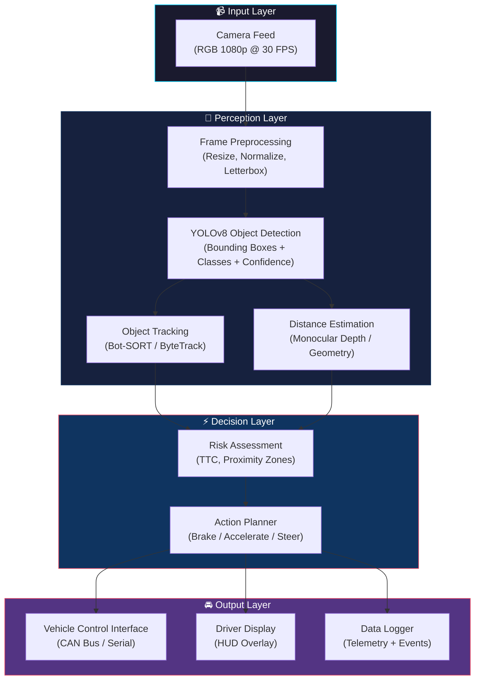

### 2.2 Component Interaction Diagram

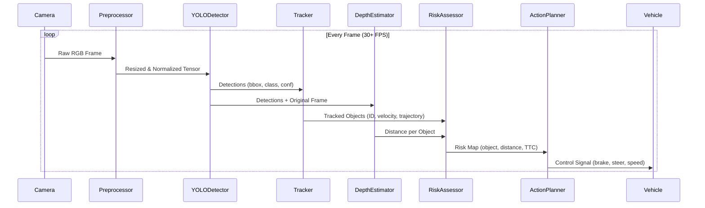

---

## 3. Object Classes & Dataset Strategy

### 3.1 Target Object Classes

The system must detect the following categories, organized by priority:

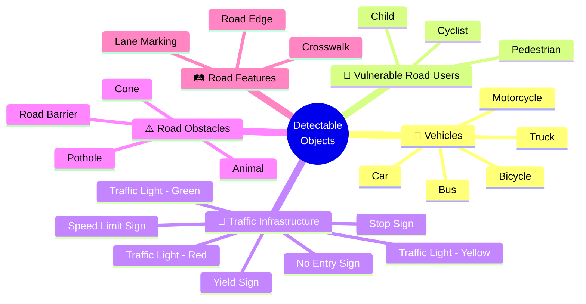

### 3.2 Complete Class List Table

| ID | Class Name | Category | Priority | Estimated Samples Needed |
|----|-----------|----------|----------|-------------------------|
| 0 | `car` | Vehicle | 🔴 Critical | 5,000+ |
| 1 | `truck` | Vehicle | 🔴 Critical | 3,000+ |
| 2 | `bus` | Vehicle | 🟡 High | 2,000+ |
| 3 | `motorcycle` | Vehicle | 🟡 High | 2,000+ |
| 4 | `bicycle` | Vehicle | 🟡 High | 2,000+ |
| 5 | `pedestrian` | VRU | 🔴 Critical | 5,000+ |
| 6 | `cyclist` | VRU | 🔴 Critical | 3,000+ |
| 7 | `traffic_light_red` | Traffic | 🔴 Critical | 3,000+ |
| 8 | `traffic_light_green` | Traffic | 🔴 Critical | 3,000+ |
| 9 | `traffic_light_yellow` | Traffic | 🟡 High | 2,000+ |
| 10 | `stop_sign` | Traffic | 🔴 Critical | 2,000+ |
| 11 | `speed_limit_sign` | Traffic | 🟡 High | 2,000+ |
| 12 | `yield_sign` | Traffic | 🟡 High | 1,500+ |
| 13 | `no_entry_sign` | Traffic | 🟡 High | 1,500+ |
| 14 | `road_barrier` | Obstacle | 🟢 Medium | 1,500+ |
| 15 | `cone` | Obstacle | 🟢 Medium | 1,500+ |
| 16 | `pothole` | Obstacle | 🟢 Medium | 1,000+ |
| 17 | `crosswalk` | Road | 🟢 Medium | 1,500+ |

**Total: 18 classes | ~45,000+ annotated images recommended**

### 3.3 Dataset Sources & Construction Strategy

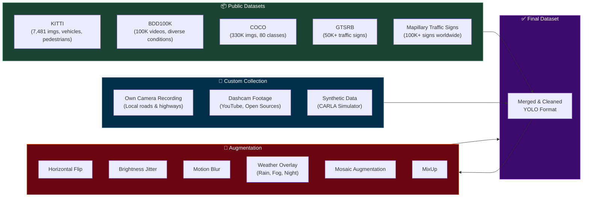

---

## 4. Model Selection & Architecture

### 4.1 YOLOv8 Architecture Overview

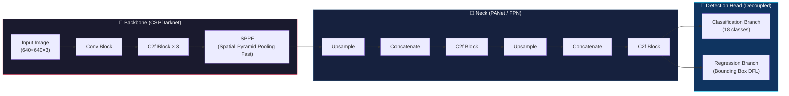

### 4.2 Model Variant Comparison

| Model | Params (M) | mAP@0.5 (COCO) | Speed GPU (ms) | Recommended Use |
|-------|-----------|-----------------|-----------------|-----------------|
| **YOLOv8n** | 3.2 | 37.3 | 1.2 | Edge devices, max speed |
| **YOLOv8s** | 11.2 | 44.9 | 1.7 | ✅ **Best balance for driving** |
| **YOLOv8m** | 25.9 | 50.2 | 3.4 | High accuracy, good GPUs |
| **YOLOv8l** | 43.7 | 52.9 | 5.3 | Cloud/server inference |
| **YOLOv8x** | 68.2 | 53.9 | 7.8 | Maximum accuracy |

> [!IMPORTANT]
> **Recommended:** Start with **YOLOv8s** for the best trade-off between speed (≥30 FPS on Jetson) and accuracy. If running on a powerful GPU (RTX 3060+), consider **YOLOv8m**.

### 4.3 Key Architectural Innovations Used

| Feature | Description |
|---------|-------------|
| **C2f Module** | Cross Stage Partial with Fine-Grained features for richer gradient flow |
| **Decoupled Head** | Separate classification and regression branches for better convergence |
| **Anchor-Free** | Eliminates hand-crafted anchor boxes; predicts object centers directly |
| **DFL Loss** | Distribution Focal Loss for precise bounding box regression |
| **Mosaic Augmentation** | Combines 4 images to learn small objects and diverse contexts |

---

## 5. Distance Estimation Module

### 5.1 Approaches Comparison

| Method | Accuracy | Speed | Hardware | Complexity |
|--------|----------|-------|----------|------------|
| **Bounding Box Geometry** | ★★☆☆☆ | ★★★★★ | Single Camera | Low |
| **Monocular Depth (MiDaS)** | ★★★★☆ | ★★★☆☆ | Single Camera + GPU | Medium |
| **Stereo Vision** | ★★★★★ | ★★★☆☆ | Dual Camera | High |
| **LiDAR Fusion** | ★★★★★ | ★★★★☆ | LiDAR + Camera | Very High |

### 5.2 Recommended Approach: Hybrid Monocular Distance Estimation

We use a **two-stage hybrid approach** combining bounding box geometry (fast) with monocular depth estimation (accurate):

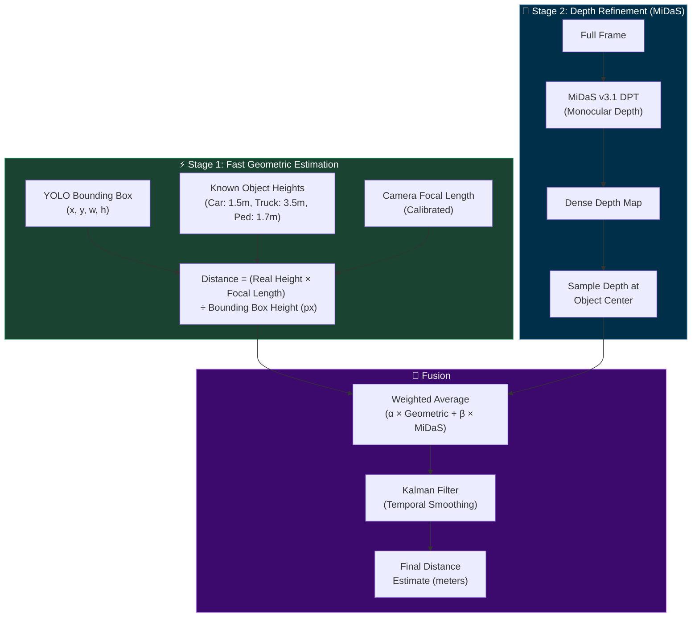

### 5.3 Camera Calibration Parameters

```
Intrinsic Matrix K:
┌              ┐
│ fx  0   cx   │
│ 0   fy  cy   │
│ 0   0   1    │
└              ┘

Where:
  fx, fy = Focal length (pixels)
  cx, cy = Principal point (image center)

Distance Formula (Pinhole Model):
  D = (H_real × f_y) / h_bbox

Where:
  D       = Distance to object (meters)
  H_real  = Known real-world height of object (meters)
  f_y     = Focal length in y-direction (pixels)
  h_bbox  = Height of bounding box in image (pixels)
```

### 5.4 Known Object Dimensions (Reference Table)

| Object Class | Avg. Height (m) | Avg. Width (m) | Avg. Length (m) |
|-------------|-----------------|-----------------|-----------------|
| Car | 1.50 | 1.80 | 4.50 |
| Truck | 3.50 | 2.50 | 12.00 |
| Bus | 3.20 | 2.50 | 12.00 |
| Motorcycle | 1.10 | 0.80 | 2.10 |
| Bicycle | 1.00 | 0.60 | 1.80 |
| Pedestrian | 1.70 | 0.50 | 0.30 |
| Traffic Light | 0.40 | 0.30 | 0.20 |
| Stop Sign | 0.75 | 0.75 | — |

---

## 6. Decision-Making Module

### 6.1 Risk Zone Classification

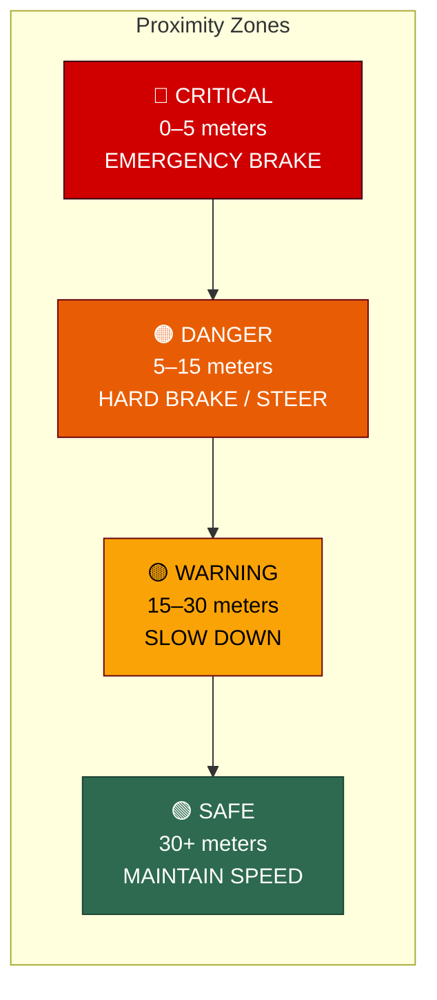

### 6.2 Decision Tree Logic

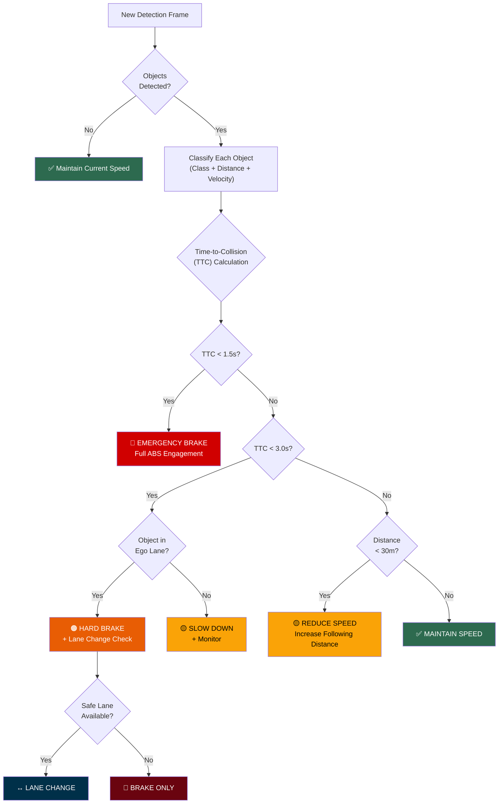

### 6.3 Time-to-Collision (TTC) Formula

```
TTC = Distance / Relative_Velocity

Where:
  Distance          = Estimated distance to object (meters)
  Relative_Velocity = (V_ego - V_object) in m/s
  
  If Relative_Velocity ≤ 0 → TTC = ∞ (object moving away or same speed)
```

### 6.4 Traffic Light Decision Logic

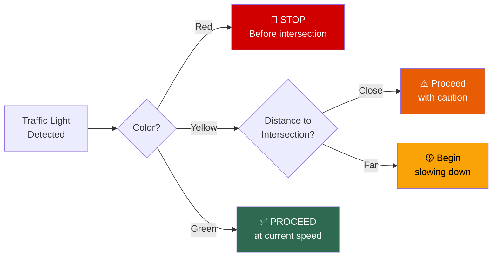

---

## 7. Real-Time Pipeline Architecture

### 7.1 Processing Pipeline (Per Frame)

```mermaid
gantt
    title Frame Processing Pipeline (~33ms budget @ 30 FPS)
    dateFormat X
    axisFormat %Lms

    section Capture
    Camera Capture         :cam, 0, 2

    section Preprocessing
    Resize + Normalize     :pre, 2, 4

    section Detection
    YOLO Inference (GPU)   :det, 4, 14

    section Tracking
    Bot-SORT Update        :track, 14, 17

    section Distance
    Depth Estimation       :depth, 14, 22

    section Decision
    Risk Assessment        :risk, 22, 26
    Action Planning        :plan, 26, 29

    section Output
    Display + Actuator     :out, 29, 33
```

### 7.2 Multi-Threaded Architecture

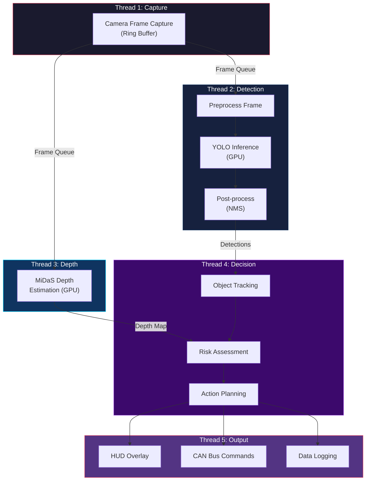

---

## 8. Dataset Creation Plan

### 8.1 Dataset Composition

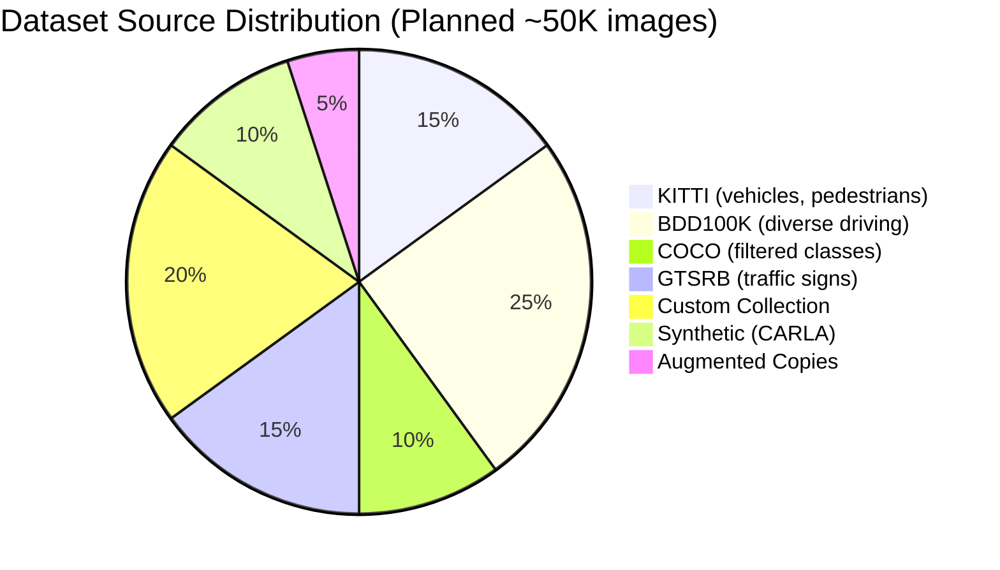

### 8.2 Step-by-Step Dataset Creation Process

#### Step 1: Collect and Download Public Datasets

| Dataset | Source | Classes Used | Format |
|---------|--------|-------------|--------|
| **KITTI** | [cvlibs.net/datasets/kitti](http://www.cvlibs.net/datasets/kitti/) | Car, Truck, Pedestrian, Cyclist | KITTI format → convert to YOLO |
| **BDD100K** | [bdd-data.berkeley.edu](https://bdd-data.berkeley.edu/) | All vehicle types, pedestrians, traffic lights | JSON → convert to YOLO |
| **COCO 2017** | [cocodataset.org](https://cocodataset.org/) | car, truck, bus, motorcycle, bicycle, person, traffic light, stop sign | COCO JSON → convert to YOLO |
| **GTSRB** | [benchmark.ini.rub.de](https://benchmark.ini.rub.de/) | Speed limits, stop, yield, no entry | Classification → create detection labels |
| **Mapillary Traffic Signs** | [mapillary.com/dataset/trafficsign](https://www.mapillary.com/dataset/trafficsign) | Global traffic signs | Convert to YOLO |

#### Step 2: Custom Data Collection

```
Recording Setup:
  ├── Camera: Dashcam or IP camera (1080p, 30 FPS, wide-angle)
  ├── Mounting: Dashboard center, facing forward
  ├── Recording Duration: 20+ hours of diverse driving
  └── Scenarios to Cover:
       ├── Urban city driving (intersections, pedestrians)
       ├── Highway driving (high speed, trucks, lane changes)
       ├── Suburban roads (residential, schools, parks)
       ├── Night driving (headlights, low visibility)
       ├── Rainy/Foggy conditions
       └── Construction zones (cones, barriers)
```

#### Step 3: Annotation Pipeline

```mermaid
flowchart LR
    RAW["Raw Images<br/>(Collected + Downloaded)"] 
    --> FILTER["Filter & Select<br/>(Remove duplicates,<br/>blur, low quality)"]
    --> ANNOTATE["Annotate with CVAT<br/>(Bounding Boxes<br/>+ Class Labels)"]
    --> REVIEW["Quality Review<br/>(Cross-check labels,<br/>fix errors)"]
    --> CONVERT["Convert to YOLO<br/>Format<br/>(txt files)"]
    --> SPLIT["Train/Val/Test Split<br/>(70/20/10)"]
    --> FINAL_DS["Final Dataset<br/>Ready for Training"]

    style RAW fill:#003049,color:#fff
    style FILTER fill:#1b4332,color:#fff
    style ANNOTATE fill:#6a040f,color:#fff
    style REVIEW fill:#e85d04,color:#fff
    style CONVERT fill:#3c096c,color:#fff
    style SPLIT fill:#0f3460,color:#fff
    style FINAL_DS fill:#2d6a4f,color:#fff
```

#### Step 4: YOLO Format Structure

```
dataset/
├── data.yaml                   # Dataset configuration
├── train/
│   ├── images/
│   │   ├── img_00001.jpg
│   │   ├── img_00002.jpg
│   │   └── ...
│   └── labels/
│       ├── img_00001.txt       # <class_id> <x_center> <y_center> <width> <height>
│       ├── img_00002.txt
│       └── ...
├── val/
│   ├── images/
│   └── labels/
└── test/
    ├── images/
    └── labels/
```

**YOLO Label Format** (normalized 0–1):
```
# <class_id> <x_center> <y_center> <width> <height>
0 0.4532 0.6210 0.1200 0.2500
5 0.7800 0.5500 0.0400 0.1800
7 0.2100 0.3000 0.0250 0.0600
```

#### Step 5: data.yaml Configuration

```yaml
# data.yaml - Dataset configuration for Ultralytics YOLO
path: ./dataset
train: train/images
val: val/images
test: test/images

# Number of classes
nc: 18

# Class names
names:
  0: car
  1: truck
  2: bus
  3: motorcycle
  4: bicycle
  5: pedestrian
  6: cyclist
  7: traffic_light_red
  8: traffic_light_green
  9: traffic_light_yellow
  10: stop_sign
  11: speed_limit_sign
  12: yield_sign
  13: no_entry_sign
  14: road_barrier
  15: cone
  16: pothole
  17: crosswalk
```

### 8.3 Data Augmentation Strategy

| Augmentation | Parameter | Purpose |
|-------------|-----------|---------|
| **Horizontal Flip** | p=0.5 | Left/right driving variations |
| **HSV Hue Shift** | ±15° | Color robustness |
| **HSV Saturation** | ±40% | Lighting variations |
| **HSV Value** | ±40% | Brightness robustness |
| **Mosaic** | p=1.0 | Multi-scale learning, small objects |
| **MixUp** | p=0.15 | Regularization |
| **Copy-Paste** | p=0.1 | Rare class augmentation |
| **Perspective** | ±0.001 | Viewpoint variations |
| **Motion Blur** | kernel=5 | Simulate fast movement |
| **Rain/Fog Overlay** | Custom | Adverse weather robustness |

---

## 9. Training Strategy

### 9.1 Training Pipeline

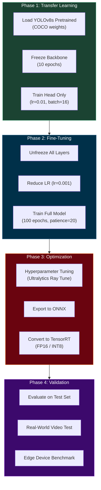

### 9.2 Kaggle Training Environment

> [!IMPORTANT]
> **Training Platform:** We use **Kaggle Notebooks** with free GPU accelerators.
> - **GPU Options:** NVIDIA Tesla P100 (16 GB) or T4 × 2 (2 × 16 GB)
> - **Session Limit:** 30 hours/week of GPU, 12-hour max session
> - **Disk:** 20 GB persistent + 70 GB temporary
> - **RAM:** 13 GB (CPU) / 13 GB (GPU mode)
> - **Dataset Integration:** Kaggle Datasets are mounted at `/kaggle/input/`

#### Kaggle Notebook Setup

```python
# ============================================================
# KAGGLE NOTEBOOK — YOLO Training for Autonomous Driving
# ============================================================
# Settings → Accelerator → GPU T4 x2 (or P100)
# Settings → Internet → ON (to download pretrained weights)
# ============================================================

# Step 1: Install Ultralytics (pre-installed on Kaggle, update to latest)
!pip install -q ultralytics --upgrade

# Step 2: Verify GPU availability
import torch
print(f"GPU Available: {torch.cuda.is_available()}")
print(f"GPU Name: {torch.cuda.get_device_name(0)}")
print(f"GPU Memory: {torch.cuda.get_device_properties(0).total_mem / 1e9:.1f} GB")

# Step 3: Link to Kaggle Dataset
# Upload your dataset as a Kaggle Dataset, then add it to the notebook.
# It will be available at: /kaggle/input/<dataset-name>/
import os
DATASET_PATH = "/kaggle/input/driving-object-detection"  # Your Kaggle dataset
OUTPUT_PATH = "/kaggle/working"                           # Writable output dir
```

#### Training Configuration (Kaggle-Optimized)

```python
from ultralytics import YOLO

# Phase 1: Transfer Learning on Kaggle
model = YOLO("yolov8s.pt")  # Auto-downloads pretrained COCO weights

results = model.train(
    data=f"{DATASET_PATH}/data.yaml",
    epochs=100,
    imgsz=640,
    batch=16,              # Fits well in P100/T4 16GB VRAM
    patience=20,
    optimizer="AdamW",
    lr0=0.01,
    lrf=0.01,              # Final learning rate factor
    momentum=0.937,
    weight_decay=0.0005,
    warmup_epochs=3,
    warmup_momentum=0.8,
    warmup_bias_lr=0.1,
    
    # Augmentation
    hsv_h=0.015,           # Hue augmentation
    hsv_s=0.7,             # Saturation augmentation
    hsv_v=0.4,             # Value augmentation
    degrees=0.0,           # Rotation
    translate=0.1,         # Translation
    scale=0.5,             # Scale
    fliplr=0.5,            # Horizontal flip
    mosaic=1.0,            # Mosaic augmentation
    mixup=0.15,            # MixUp augmentation
    copy_paste=0.1,        # Copy-Paste augmentation
    
    # Hardware — Kaggle GPU
    device=0,              # GPU 0 (P100 or T4)
    workers=2,             # Kaggle has limited CPU cores
    
    # Saving — output to /kaggle/working/ (downloadable)
    project=f"{OUTPUT_PATH}/runs/train",
    name="driving_detector_v1",
    save=True,
    save_period=10,        # Checkpoint every 10 epochs (resume if session expires)
    plots=True,
)

# Step 4: Download best weights after training
# The best model will be saved at:
# /kaggle/working/runs/train/driving_detector_v1/weights/best.pt
# → Click "Save Version" → "Save & Run All" to persist outputs
print(f"Best model saved at: {OUTPUT_PATH}/runs/train/driving_detector_v1/weights/best.pt")
```

### 9.3 Kaggle Session Management Tips

> [!WARNING]
> Kaggle sessions expire after **12 hours max**. Plan your training strategy accordingly:

| Tip | Description |
|-----|-------------|
| **Use `save_period=10`** | Save checkpoints every 10 epochs to resume if session expires |
| **Resume training** | Use `model = YOLO("last.pt")` then `model.train(resume=True)` to continue |
| **Split training** | Phase 1 (frozen backbone, 10 epochs) in one session, Phase 2 (fine-tune, 100 epochs) across multiple sessions |
| **Save outputs** | Click **"Save Version"** → **"Save & Run All"** to persist `best.pt` weights |
| **Use Kaggle Datasets** | Upload your dataset as a Kaggle Dataset for instant `/kaggle/input/` access (no download time) |
| **Monitor GPU usage** | Use `!nvidia-smi` periodically to check VRAM usage |

#### Resuming Training Across Sessions

```python
from ultralytics import YOLO

# If session expired mid-training, resume from last checkpoint:
# 1. Download last.pt from previous session output
# 2. Upload it as a Kaggle Dataset or add to notebook files
# 3. Resume:

model = YOLO("/kaggle/input/previous-run/last.pt")  # Load checkpoint
results = model.train(resume=True)                    # Continues from where it stopped
```

### 9.4 Hyperparameter Tuning

```python
# Automated hyperparameter tuning with Ray Tune (on Kaggle)
# Note: This is resource-intensive; consider reducing iterations on free tier
model = YOLO("yolov8s.pt")
result_grid = model.tune(
    data=f"{DATASET_PATH}/data.yaml",
    epochs=30,
    iterations=20,         # Reduced for Kaggle time limits
    optimizer="AdamW",
    plots=True,
    save=True,
    val=True,
)
```

---

## 10. Deployment & Edge Integration

### 10.1 Deployment Architecture

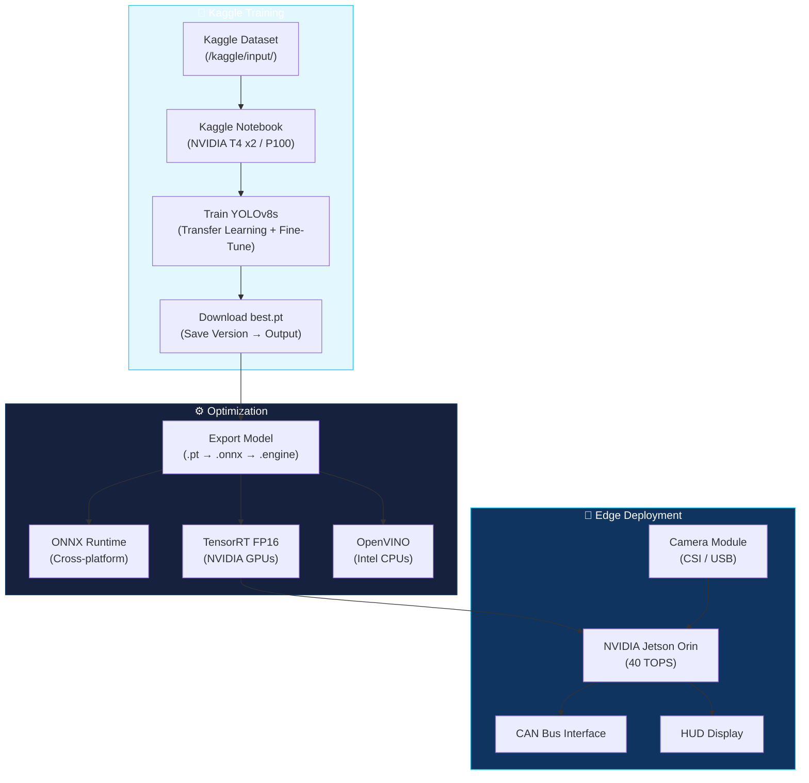

### 10.2 Model Export Commands

```python
from ultralytics import YOLO

# Load the best model (downloaded from Kaggle output)
model = YOLO("best.pt")  # Downloaded from Kaggle notebook output

# Export to ONNX (can be done on Kaggle or locally)
model.export(format="onnx", imgsz=640, half=True, simplify=True)

# Export to TensorRT (for NVIDIA Jetson — do this on the Jetson device)
model.export(format="engine", imgsz=640, half=True, device=0)

# Export to OpenVINO (for Intel)
model.export(format="openvino", imgsz=640, half=True)
```

### 10.3 Edge Hardware Specifications

| Feature | Jetson Orin Nano | Jetson Orin NX | Jetson AGX Orin |
|---------|-----------------|----------------|-----------------|
| **AI Performance** | 40 TOPS | 100 TOPS | 275 TOPS |
| **GPU** | 1024-core Ampere | 1024-core Ampere | 2048-core Ampere |
| **CPU** | 6-core Cortex-A78 | 8-core Cortex-A78 | 12-core Cortex-A78 |
| **RAM** | 8 GB | 16 GB | 64 GB |
| **YOLOv8s FPS** | ~35 FPS | ~60 FPS | ~90+ FPS |
| **Price (Est.)** | $199 | $399 | $999 |
| **Recommended** | ✅ Budget | ✅ **Best Value** | Premium |

---

## 11. Development Phases & Timeline

### 11.1 Phase Overview (Gantt Chart)

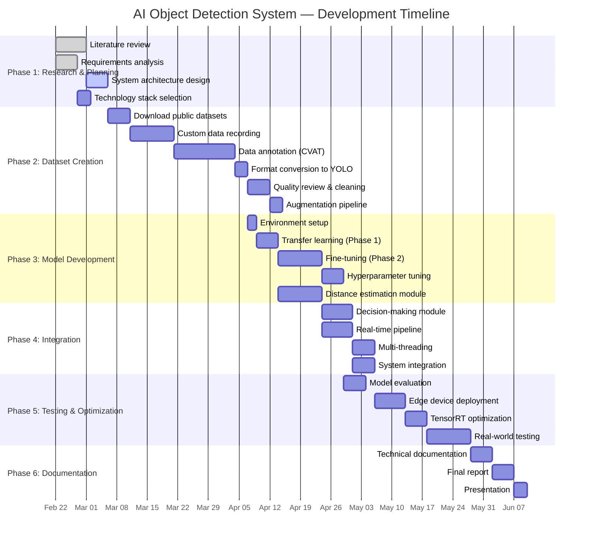

### 11.2 Detailed Phase Breakdown

#### 📌 Phase 1: Research & Planning (Weeks 1–2)

| Task | Description | Deliverable |
|------|-------------|-------------|
| 1.1 | Review YOLO papers and Ultralytics documentation | Literature review document |
| 1.2 | Study distance estimation methods (monocular, stereo) | Comparison matrix |
| 1.3 | Analyze existing autonomous driving datasets | Dataset selection report |
| 1.4 | Design system architecture (all modules) | Architecture diagrams |
| 1.5 | Define object classes and requirements | Class specification table |
| 1.6 | Select hardware and software stack | Technology stack document |

#### 📌 Phase 2: Dataset Creation (Weeks 3–7)

| Task | Description | Deliverable |
|------|-------------|-------------|
| 2.1 | Download and preprocess KITTI dataset | YOLO-format KITTI subset |
| 2.2 | Download and preprocess BDD100K dataset | YOLO-format BDD100K subset |
| 2.3 | Filter relevant COCO classes | YOLO-format COCO subset |
| 2.4 | Download and preprocess GTSRB | Traffic sign detection labels |
| 2.5 | Record custom driving footage (20+ hours) | Raw video recordings |
| 2.6 | Extract frames from custom recordings (2 FPS) | ~144K raw frames |
| 2.7 | Select and filter best frames | ~10K curated frames |
| 2.8 | Annotate with CVAT (bounding boxes) | YOLO label files |
| 2.9 | Merge all datasets + unify class mapping | Unified `data.yaml` |
| 2.10 | 70/20/10 Train/Val/Test split | Final dataset (~50K images) |
| 2.11 | Apply augmentations pipeline | Augmented training set |

#### 📌 Phase 3: Model Development (Weeks 5–9)

| Task | Description | Deliverable |
|------|-------------|-------------|
| 3.1 | Set up Kaggle Notebook with GPU accelerator + upload dataset | Working Kaggle environment |
| 3.2 | Train YOLOv8s with frozen backbone (10 epochs) | Phase 1 weights |
| 3.3 | Fine-tune full model (100 epochs) | Phase 2 best weights |
| 3.4 | Run hyperparameter tuning (Ray Tune) | Optimal hyperparams |
| 3.5 | Implement camera calibration module | Calibration tool |
| 3.6 | Implement geometric distance estimator | Distance module v1 |
| 3.7 | Integrate MiDaS monocular depth | Distance module v2 |
| 3.8 | Implement Kalman filter for distance smoothing | Smoothed distances |

#### 📌 Phase 4: Integration (Weeks 8–11)

| Task | Description | Deliverable |
|------|-------------|-------------|
| 4.1 | Implement risk zone classifier | Risk assessment module |
| 4.2 | Implement TTC calculator | Collision prediction |
| 4.3 | Implement action planner (brake/steer/go) | Decision engine |
| 4.4 | Build real-time video pipeline | Streaming inference |
| 4.5 | Add Bot-SORT / ByteTrack tracking | Multi-object tracker |
| 4.6 | Implement multi-threaded pipeline | Optimized throughput |
| 4.7 | Build HUD overlay (OpenCV visualization) | Visual output |
| 4.8 | System integration testing | Integrated prototype |

#### 📌 Phase 5: Testing & Optimization (Weeks 10–14)

| Task | Description | Deliverable |
|------|-------------|-------------|
| 5.1 | Evaluate mAP, precision, recall on test set | Performance report |
| 5.2 | Profile inference speed on target hardware | Latency benchmarks |
| 5.3 | Export to ONNX and TensorRT | Optimized model files |
| 5.4 | Benchmark on Jetson device | FPS measurements |
| 5.5 | Test on real-world driving videos | Qualitative analysis |
| 5.6 | Stress test edge cases (night, rain, glare) | Edge case report |
| 5.7 | Iteratively improve (retrain on failures) | Improved model |

#### 📌 Phase 6: Documentation & Presentation (Weeks 14–16)

| Task | Description | Deliverable |
|------|-------------|-------------|
| 6.1 | Write technical documentation | Full technical doc |
| 6.2 | Create performance comparison tables | Benchmark report |
| 6.3 | Prepare final project report (PFE) | Project report |
| 6.4 | Create presentation slides | Defense presentation |
| 6.5 | Record demo video | Video demonstration |

---

## 12. Risk Analysis & Mitigation

### 12.1 Risk Matrix

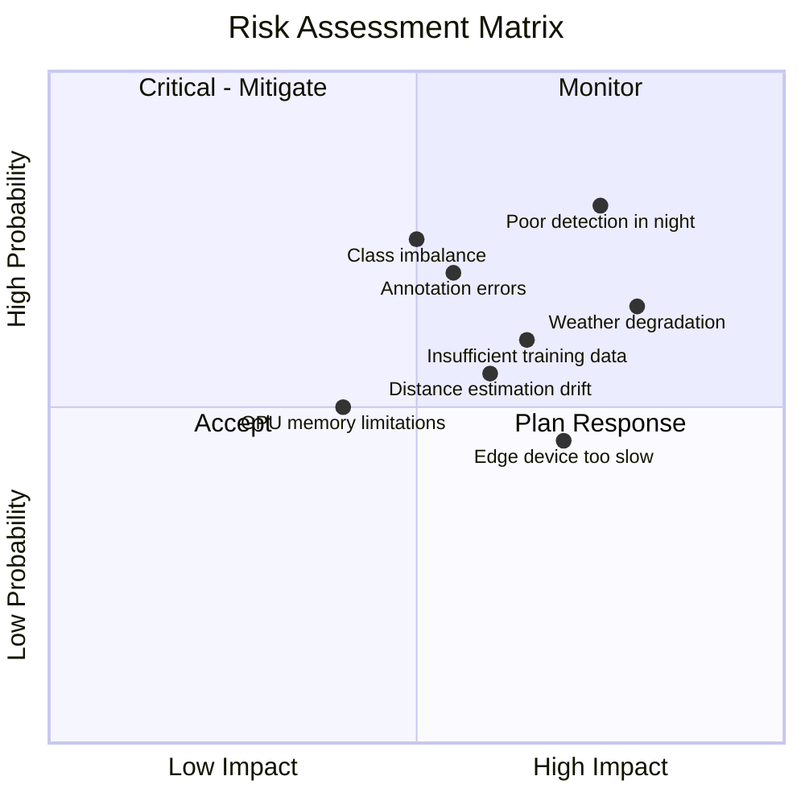

### 12.2 Risk Mitigation Strategies

| Risk | Impact | Probability | Mitigation |
|------|--------|------------|------------|
| **Poor night detection** | High | High | Add night-specific training data, IR camera consideration |
| **Weather degradation** | High | Medium | Augment with rain/fog overlays, use CARLA simulator |
| **Insufficient data** | High | Medium | Use transfer learning, leverage large public datasets |
| **Class imbalance** | Medium | High | Oversample rare classes, use focal loss, copy-paste augmentation |
| **Annotation errors** | Medium | High | Multi-person review, use semi-auto annotation tools |
| **Edge device speed** | High | Medium | Use TensorRT FP16, reduce input size, prune model |
| **Distance estimation drift** | Medium | Medium | Kalman filtering, sensor fusion, regular recalibration |
| **GPU memory limits** | Medium | Medium | Gradient accumulation, mixed precision (FP16) training |

---

## 13. Evaluation Metrics

### 13.1 Object Detection Metrics

| Metric | Formula | Target |
|--------|---------|--------|
| **mAP@0.5** | Mean Average Precision at IoU 0.5 | ≥ 0.85 |
| **mAP@0.5:0.95** | Mean AP across IoU thresholds | ≥ 0.60 |
| **Precision** | TP / (TP + FP) | ≥ 0.90 |
| **Recall** | TP / (TP + FN) | ≥ 0.85 |
| **F1-Score** | 2 × (P × R) / (P + R) | ≥ 0.87 |
| **FPS** | Frames processed per second | ≥ 30 |
| **Latency** | End-to-end inference time | ≤ 33ms |

### 13.2 Distance Estimation Metrics

| Metric | Description | Target |
|--------|-------------|--------|
| **MAE** | Mean Absolute Error (meters) | ≤ 2.0m |
| **RMSE** | Root Mean Squared Error | ≤ 3.0m |
| **Rel. Error** | |Predicted - Actual| / Actual × 100 | ≤ 10% |
| **δ < 1.25** | % predictions within 1.25× of ground truth | ≥ 85% |

### 13.3 System-Level Metrics

| Metric | Description | Target |
|--------|-------------|--------|
| **End-to-End FPS** | Complete pipeline throughput | ≥ 30 FPS |
| **Decision Latency** | Time from detection to action signal | ≤ 50ms |
| **False Alarm Rate** | Unnecessary emergency brakes / hour | ≤ 1 |
| **Miss Rate** | Critical objects not detected | ≤ 2% |
| **Power Consumption** | Edge device power draw | ≤ 30W |

---

## 14. Project Directory Structure

```
PFE/
├── README.md                          # Project overview
├── requirements.txt                   # Python dependencies
├── data.yaml                          # Dataset configuration
│
├── dataset/                           # Training data
│   ├── train/
│   │   ├── images/
│   │   └── labels/
│   ├── val/
│   │   ├── images/
│   │   └── labels/
│   └── test/
│       ├── images/
│       └── labels/
│
├── scripts/                           # Utility scripts
│   ├── convert_kitti_to_yolo.py       # KITTI format converter
│   ├── convert_bdd_to_yolo.py         # BDD100K format converter
│   ├── convert_coco_to_yolo.py        # COCO format converter
│   ├── augmentation_pipeline.py       # Custom augmentations
│   ├── camera_calibration.py          # Camera calibration tool
│   └── visualize_annotations.py       # Label visualization
│
├── src/                               # Source code
│   ├── detection/
│   │   ├── detector.py                # YOLO detection wrapper
│   │   └── tracker.py                 # Object tracking (Bot-SORT)
│   ├── distance/
│   │   ├── geometric_estimator.py     # Pinhole model distance
│   │   ├── midas_estimator.py         # MiDaS depth estimation
│   │   ├── fusion.py                  # Distance fusion module
│   │   └── kalman_filter.py           # Temporal smoothing
│   ├── decision/
│   │   ├── risk_assessor.py           # Zone-based risk scoring
│   │   ├── ttc_calculator.py          # Time-to-collision
│   │   └── action_planner.py          # Driving action decisions
│   ├── pipeline/
│   │   ├── realtime_pipeline.py       # Main real-time pipeline
│   │   ├── video_capture.py           # Multi-threaded capture
│   │   └── hud_overlay.py             # Visual HUD rendering
│   └── utils/
│       ├── config.py                  # Configuration management
│       ├── logger.py                  # Logging utilities
│       └── visualization.py           # Debug visualization
│
├── configs/                           # Configuration files
│   ├── model_config.yaml              # Model hyperparameters
│   ├── camera_params.yaml             # Camera intrinsics
│   └── decision_thresholds.yaml       # Risk zone thresholds
│
├── runs/                              # Training outputs
│   └── train/
│       └── driving_detector_v1/
│           ├── weights/
│           │   ├── best.pt
│           │   └── last.pt
│           └── results.csv
│
├── exports/                           # Exported models
│   ├── best.onnx
│   ├── best.engine                    # TensorRT
│   └── best_openvino/                 # OpenVINO
│
├── notebooks/                         # Jupyter notebooks
│   ├── 01_data_exploration.ipynb
│   ├── 02_training_analysis.ipynb
│   └── 03_distance_calibration.ipynb
│
├── tests/                             # Unit tests
│   ├── test_detector.py
│   ├── test_distance.py
│   └── test_decision.py
│
└── docs/                              # Documentation
    ├── architecture.md
    ├── dataset_guide.md
    └── deployment_guide.md
```

---

## 15. Class Diagram (Software Design)

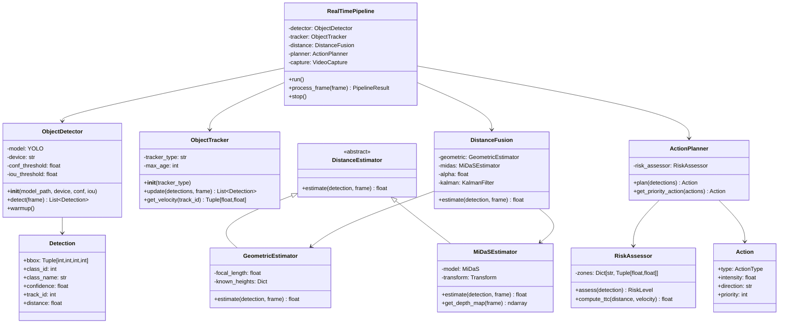

---

## 16. Use Case Diagram

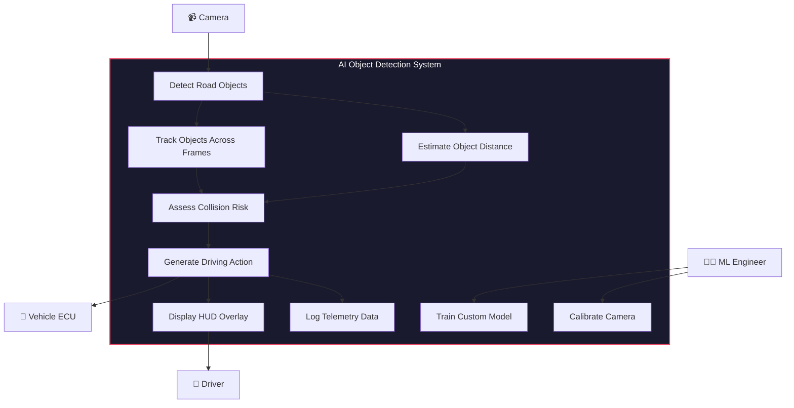

---

## 17. Deployment Diagram

```mermaid
graph TB
    subgraph KAGGLE["📓 Kaggle (Training Platform)"]
        KAGGLE_NB["Kaggle Notebook<br/>NVIDIA T4 x2 / P100<br/>Python 3.10 + CUDA"]
        KAGGLE_DS["Kaggle Dataset<br/>/kaggle/input/<br/>~50K images"]
        KAGGLE_OUT["Notebook Output<br/>best.pt / last.pt<br/>(Download Weights)"]
    end

    subgraph LOCAL["💻 Local Machine"]
        EXPORT_LOCAL["Export to ONNX<br/>Model Optimization"]
    end

    subgraph EDGE["🚗 Vehicle Edge Unit"]
        JETSON["NVIDIA Jetson Orin NX<br/>TensorRT Runtime<br/>JetPack 6.0"]
        CAM["Camera Module<br/>CSI / USB 3.0<br/>1080p @ 30 FPS"]
        CANBUS["CAN Bus Interface<br/>Vehicle Control"]
        DISPLAY["7\" HUD Display<br/>HDMI Output"]
        POWER["12V DC Power<br/>Car Battery"]
    end

    subgraph NETWORK["🌐 OTA Updates"]
        OTA["Model Update Server<br/>(New weights push)"]
    end

    KAGGLE_DS --> KAGGLE_NB
    KAGGLE_NB --> KAGGLE_OUT
    KAGGLE_OUT --> |Download best.pt| EXPORT_LOCAL
    EXPORT_LOCAL --> |Export .engine| JETSON
    CAM --> JETSON
    JETSON --> CANBUS
    JETSON --> DISPLAY
    POWER --> JETSON
    OTA -.-> |WiFi Update| JETSON

    style KAGGLE fill:#20beff20,stroke:#20beff,color:#fff
    style LOCAL fill:#003049,stroke:#669bbc,color:#fff
    style EDGE fill:#1b4332,stroke:#52b788,color:#fff
    style NETWORK fill:#3c096c,stroke:#c77dff,color:#fff
```

---

## 18. Activity Diagram (Main Detection Loop)

```mermaid
stateDiagram-v2
    [*] --> Initialize
    Initialize --> CaptureFrame
    
    CaptureFrame --> Preprocess
    Preprocess --> RunYOLO
    RunYOLO --> ObjectsDetected
    
    ObjectsDetected --> NoObjects: No detections
    ObjectsDetected --> TrackObjects: Objects found
    
    NoObjects --> MaintainSpeed
    MaintainSpeed --> CaptureFrame
    
    TrackObjects --> EstimateDistance
    EstimateDistance --> AssessRisk
    
    AssessRisk --> CriticalZone: Distance < 5m
    AssessRisk --> DangerZone: Distance 5-15m
    AssessRisk --> WarningZone: Distance 15-30m
    AssessRisk --> SafeZone: Distance > 30m
    
    CriticalZone --> EmergencyBrake
    DangerZone --> HardBrake
    WarningZone --> SlowDown
    SafeZone --> MaintainSpeed
    
    EmergencyBrake --> LogEvent
    HardBrake --> CheckLaneChange
    SlowDown --> LogEvent
    
    CheckLaneChange --> LaneAvailable: Safe lane
    CheckLaneChange --> BrakeOnly: No safe lane
    
    LaneAvailable --> ExecuteLaneChange
    BrakeOnly --> LogEvent
    ExecuteLaneChange --> LogEvent
    
    LogEvent --> UpdateHUD
    UpdateHUD --> CaptureFrame
```

---

## 19. Summary

This report presents a comprehensive design for an **AI-powered object detection system** for autonomous driving using **Ultralytics YOLO**. The system covers:

| Module | Key Technology |
|--------|---------------|
| **Object Detection** | YOLOv8s with custom 18-class dataset |
| **Object Tracking** | Bot-SORT / ByteTrack multi-object tracker |
| **Distance Estimation** | Hybrid geometric + MiDaS monocular depth |
| **Decision Making** | Zone-based risk assessment + TTC calculator |
| **Real-Time Pipeline** | Multi-threaded processing @ 30+ FPS |
| **Deployment** | TensorRT on NVIDIA Jetson Orin |

> [!TIP]
> **Next Steps:** Begin with Phase 1 (Research & Planning), then proceed to Phase 2 (Dataset Creation) which is the most time-intensive task. The custom dataset is the foundation — invest time in quality annotations for the best results.

---

*Report generated for PFE Project — AI Object Detection for Autonomous Driving*  
*Framework: [Ultralytics YOLO](https://github.com/ultralytics/ultralytics) | License: AGPL-3.0*
