# 🚗 Système de Détection d'Objets par IA pour la Conduite Autonome
## Détection d'Objets en Temps Réel, Estimation de Distance & Prise de Décision

**Cadre du Projet :** [Ultralytics YOLO](https://github.com/ultralytics/ultralytics)  
**Date :** Février 2026  
**Statut :** Plan de Développement & Rapport de Conception du Système

---

## Table des Matières

1. [Aperçu du Projet](#1-aperçu-du-projet)
2. [Architecture du Système](#2-architecture-du-système)
3. [Classes d'Objets & Stratégie de Données](#3-classes-dobjets--stratégie-de-données)
4. [Sélection du Modèle & Architecture](#4-sélection-du-modèle--architecture)
5. [Module d'Estimation de Distance](#5-module-destimation-de-distance)
6. [Module de Prise de Décision](#6-module-de-prise-de-décision)
7. [Architecture du Pipeline Temps Réel](#7-architecture-du-pipeline-temps-réel)
8. [Plan de Création du Dataset](#8-plan-de-création-du-dataset)
9. [Stratégie d'Entraînement](#9-stratégie-dentraînement)
10. [Déploiement & Intégration Embarquée](#10-déploiement--intégration-embarquée)
11. [Phases de Développement & Calendrier](#11-phases-de-développement--calendrier)
12. [Analyse des Risques & Atténuation](#12-analyse-des-risques--atténuation)
13. [Métriques d'Évaluation](#13-métriques-dévaluation)

---

## 1. Aperçu du Projet

### 1.1 Problématique

Les véhicules autonomes et semi-autonomes nécessitent des systèmes de perception robustes capables de détecter, classifier et estimer la distance des objets environnants en temps réel. Une détection précise et une estimation de distance fiable sont essentielles pour prendre des décisions de conduite sûres telles que le freinage, le changement de voie et l'évitement de collision.

### 1.2 Objectifs

| # | Objectif | Priorité |
|---|----------|----------|
| 1 | Détecter les objets routiers clés (véhicules, piétons, panneaux, etc.) en temps réel | 🔴 Critique |
| 2 | Estimer la distance de chaque objet détecté à l'aide d'une caméra monoculaire | 🔴 Critique |
| 3 | Prendre des décisions de conduite (freiner, accélérer, diriger) basées sur les détections | 🔴 Critique |
| 4 | Atteindre ≥30 FPS sur du matériel embarqué (ex. NVIDIA Jetson) | 🟡 Élevée |
| 5 | Créer un dataset personnalisé adapté à l'environnement de conduite cible | 🟡 Élevée |
| 6 | Atteindre un mAP@0.5 ≥ 0.85 sur le jeu de test personnalisé | 🟢 Moyenne |

### 1.3 Stack Technologique

| Composant | Technologie |
|-----------|-------------|
| **Détection d'Objets** | Ultralytics YOLOv8 / YOLO11 |
| **Framework d'Apprentissage Profond** | PyTorch ≥ 2.0 |
| **Plateforme d'Entraînement** | Notebooks Kaggle (GPU Gratuit : NVIDIA Tesla P100 / T4 × 2) |
| **Estimation de Distance** | MiDaS / Profondeur Monoculaire Personnalisée |
| **Optimisation d'Inférence** | ONNX, TensorRT, OpenVINO |
| **Matériel Embarqué** | NVIDIA Jetson Orin / Jetson Xavier NX |
| **Caméra** | Monoculaire RGB (au moins 1080p, 30+ FPS) |
| **Gestion du Dataset** | Roboflow / CVAT / LabelImg |
| **Suivi** | Bot-SORT / ByteTrack |
| **Langage** | Python 3.10+ |

---

## 2. Architecture du Système

### 2.1 Diagramme d'Architecture de Haut Niveau

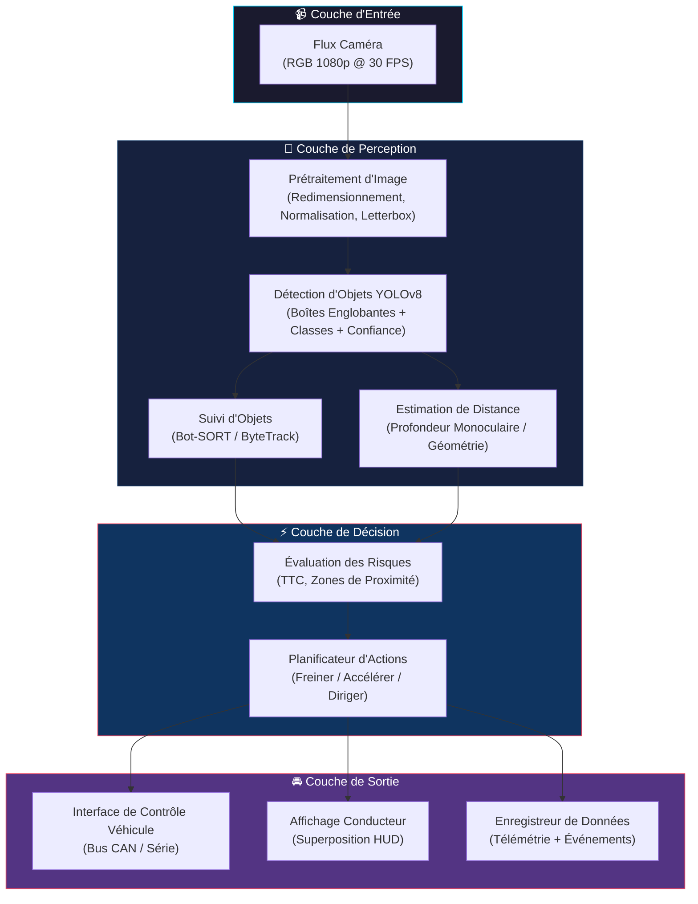
```mermaid
graph TB
    subgraph INPUT["📹 Couche d'Entrée"]
        CAM["Flux Caméra<br/>(RGB 1080p @ 30 FPS)"]
    end

    subgraph PERCEPTION["🧠 Couche de Perception"]
        PREPROCESS["Prétraitement d'Image<br/>(Redimensionnement, Normalisation, Letterbox)"]
        DETECTION["Détection d'Objets YOLOv8<br/>(Boîtes Englobantes + Classes + Confiance)"]
        TRACKING["Suivi d'Objets<br/>(Bot-SORT / ByteTrack)"]
        DEPTH["Estimation de Distance<br/>(Profondeur Monoculaire / Géométrie)"]
    end

    subgraph DECISION["⚡ Couche de Décision"]
        RISK["Évaluation des Risques<br/>(TTC, Zones de Proximité)"]
        PLANNER["Planificateur d'Actions<br/>(Freiner / Accélérer / Diriger)"]
    end

    subgraph OUTPUT["🚘 Couche de Sortie"]
        ACTUATOR["Interface de Contrôle Véhicule<br/>(Bus CAN / Série)"]
        DISPLAY["Affichage Conducteur<br/>(Superposition HUD)"]
        LOGGER["Enregistreur de Données<br/>(Télémétrie + Événements)"]
    end

    CAM --> PREPROCESS
    PREPROCESS --> DETECTION
    DETECTION --> TRACKING
    DETECTION --> DEPTH
    TRACKING --> RISK
    DEPTH --> RISK
    RISK --> PLANNER
    PLANNER --> ACTUATOR
    PLANNER --> DISPLAY
    PLANNER --> LOGGER

    style INPUT fill:#1a1a2e,stroke:#00d4ff,color:#fff
    style PERCEPTION fill:#16213e,stroke:#0f3460,color:#fff
    style DECISION fill:#0f3460,stroke:#e94560,color:#fff
    style OUTPUT fill:#533483,stroke:#e94560,color:#fff
```

### 2.2 Diagramme d'Interaction des Composants

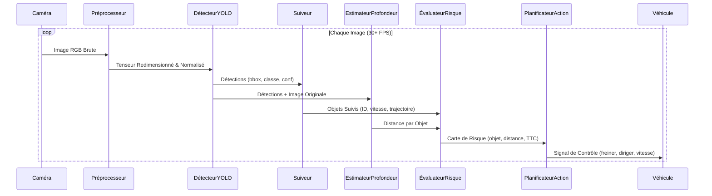
```mermaid
sequenceDiagram
    participant Caméra
    participant Préprocesseur
    participant DétecteurYOLO
    participant Suiveur
    participant EstimateurProfondeur
    participant ÉvaluateurRisque
    participant PlanificateurAction
    participant Véhicule

    loop Chaque Image (30+ FPS)
        Caméra->>Préprocesseur: Image RGB Brute
        Préprocesseur->>DétecteurYOLO: Tenseur Redimensionné & Normalisé
        DétecteurYOLO->>Suiveur: Détections (bbox, classe, conf)
        DétecteurYOLO->>EstimateurProfondeur: Détections + Image Originale
        Suiveur->>ÉvaluateurRisque: Objets Suivis (ID, vitesse, trajectoire)
        EstimateurProfondeur->>ÉvaluateurRisque: Distance par Objet
        ÉvaluateurRisque->>PlanificateurAction: Carte de Risque (objet, distance, TTC)
        PlanificateurAction->>Véhicule: Signal de Contrôle (freiner, diriger, vitesse)
    end
```

---

## 3. Classes d'Objets & Stratégie de Données

### 3.1 Classes d'Objets Cibles

Le système doit détecter les catégories suivantes, organisées par priorité :

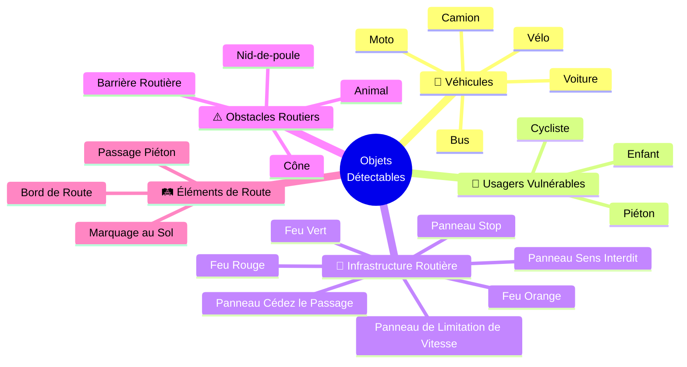
```mermaid
mindmap
  root((Objets<br/>Détectables))
    🚗 Véhicules
      Voiture
      Camion
      Bus
      Moto
      Vélo
    🚶 Usagers Vulnérables
      Piéton
      Cycliste
      Enfant
    🚦 Infrastructure Routière
      Feu Rouge
      Feu Vert
      Feu Orange
      Panneau Stop
      Panneau de Limitation de Vitesse
      Panneau Cédez le Passage
      Panneau Sens Interdit
    ⚠️ Obstacles Routiers
      Barrière Routière
      Cône
      Nid-de-poule
      Animal
    🛤️ Éléments de Route
      Marquage au Sol
      Passage Piéton
      Bord de Route
```

### 3.2 Tableau Complet des Classes

| ID | Nom de Classe | Catégorie | Priorité | Échantillons Estimés Nécessaires |
|----|--------------|-----------|----------|----------------------------------|
| 0 | `car` | Véhicule | 🔴 Critique | 5 000+ |
| 1 | `truck` | Véhicule | 🔴 Critique | 3 000+ |
| 2 | `bus` | Véhicule | 🟡 Élevée | 2 000+ |
| 3 | `motorcycle` | Véhicule | 🟡 Élevée | 2 000+ |
| 4 | `bicycle` | Véhicule | 🟡 Élevée | 2 000+ |
| 5 | `pedestrian` | UVR | 🔴 Critique | 5 000+ |
| 6 | `cyclist` | UVR | 🔴 Critique | 3 000+ |
| 7 | `traffic_light_red` | Signalisation | 🔴 Critique | 3 000+ |
| 8 | `traffic_light_green` | Signalisation | 🔴 Critique | 3 000+ |
| 9 | `traffic_light_yellow` | Signalisation | 🟡 Élevée | 2 000+ |
| 10 | `stop_sign` | Signalisation | 🔴 Critique | 2 000+ |
| 11 | `speed_limit_sign` | Signalisation | 🟡 Élevée | 2 000+ |
| 12 | `yield_sign` | Signalisation | 🟡 Élevée | 1 500+ |
| 13 | `no_entry_sign` | Signalisation | 🟡 Élevée | 1 500+ |
| 14 | `road_barrier` | Obstacle | 🟢 Moyenne | 1 500+ |
| 15 | `cone` | Obstacle | 🟢 Moyenne | 1 500+ |
| 16 | `pothole` | Obstacle | 🟢 Moyenne | 1 000+ |
| 17 | `crosswalk` | Route | 🟢 Moyenne | 1 500+ |

**Total : 18 classes | ~45 000+ images annotées recommandées**

### 3.3 Sources de Données & Stratégie de Construction

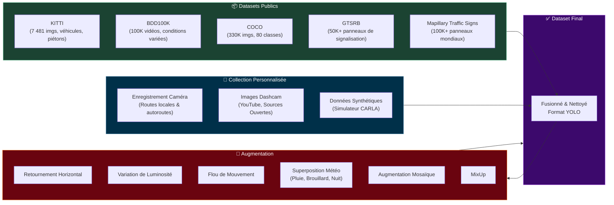
```mermaid
graph LR
    subgraph PUBLIC["📦 Datasets Publics"]
        KITTI["KITTI<br/>(7 481 imgs, véhicules, piétons)"]
        BDD["BDD100K<br/>(100K vidéos, conditions variées)"]
        COCO["COCO<br/>(330K imgs, 80 classes)"]
        GTSRB["GTSRB<br/>(50K+ panneaux de signalisation)"]
        MAPILLARY["Mapillary Traffic Signs<br/>(100K+ panneaux mondiaux)"]
    end

    subgraph CUSTOM["📸 Collection Personnalisée"]
        OWN_CAM["Enregistrement Caméra<br/>(Routes locales & autoroutes)"]
        DASHCAM["Images Dashcam<br/>(YouTube, Sources Ouvertes)"]
        SYNTH["Données Synthétiques<br/>(Simulateur CARLA)"]
    end

    subgraph AUGMENT["🔄 Augmentation"]
        FLIP["Retournement Horizontal"]
        BRIGHTNESS["Variation de Luminosité"]
        BLUR["Flou de Mouvement"]
        WEATHER["Superposition Météo<br/>(Pluie, Brouillard, Nuit)"]
        MOSAIC["Augmentation Mosaïque"]
        MIXUP["MixUp"]
    end

    subgraph FINAL["✅ Dataset Final"]
        MERGED["Fusionné & Nettoyé<br/>Format YOLO"]
    end

    PUBLIC --> MERGED
    CUSTOM --> MERGED
    MERGED --> AUGMENT
    AUGMENT --> FINAL

    style PUBLIC fill:#1b4332,stroke:#52b788,color:#fff
    style CUSTOM fill:#003049,stroke:#669bbc,color:#fff
    style AUGMENT fill:#6a040f,stroke:#e85d04,color:#fff
    style FINAL fill:#3c096c,stroke:#c77dff,color:#fff
```

---

## 4. Sélection du Modèle & Architecture

### 4.1 Aperçu de l'Architecture YOLOv8

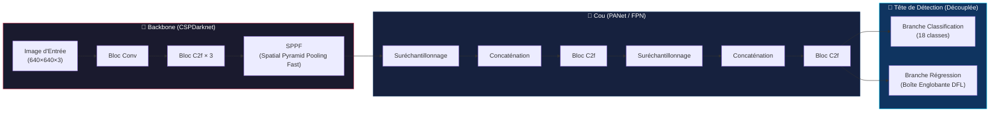
```mermaid
graph LR
    subgraph BACKBONE["🔧 Backbone (CSPDarknet)"]
        INPUT_IMG["Image d'Entrée<br/>(640×640×3)"]
        CONV1["Bloc Conv"]
        C2F1["Bloc C2f × 3"]
        SPPF["SPPF<br/>(Spatial Pyramid Pooling Fast)"]
    end

    subgraph NECK["🔗 Cou (PANet / FPN)"]
        UPSAMPLE1["Suréchantillonnage"]
        CONCAT1["Concaténation"]
        C2F2["Bloc C2f"]
        UPSAMPLE2["Suréchantillonnage"]
        CONCAT2["Concaténation"]
        C2F3["Bloc C2f"]
    end

    subgraph HEAD["🎯 Tête de Détection (Découplée)"]
        CLS["Branche Classification<br/>(18 classes)"]
        REG["Branche Régression<br/>(Boîte Englobante DFL)"]
    end

    INPUT_IMG --> CONV1
    CONV1 --> C2F1
    C2F1 --> SPPF
    SPPF --> UPSAMPLE1
    UPSAMPLE1 --> CONCAT1
    CONCAT1 --> C2F2
    C2F2 --> UPSAMPLE2
    UPSAMPLE2 --> CONCAT2
    CONCAT2 --> C2F3
    C2F3 --> CLS
    C2F3 --> REG

    style BACKBONE fill:#1a1a2e,stroke:#e94560,color:#fff
    style NECK fill:#16213e,stroke:#0f3460,color:#fff
    style HEAD fill:#0f3460,stroke:#00d4ff,color:#fff
```

### 4.2 Comparaison des Variantes de Modèle

| Modèle | Params (M) | mAP@0.5 (COCO) | Vitesse GPU (ms) | Utilisation Recommandée |
|--------|-----------|-----------------|-------------------|-------------------------|
| **YOLOv8n** | 3.2 | 37.3 | 1.2 | Appareils embarqués, vitesse max |
| **YOLOv8s** | 11.2 | 44.9 | 1.7 | ✅ **Meilleur équilibre pour la conduite** |
| **YOLOv8m** | 25.9 | 50.2 | 3.4 | Haute précision, bons GPUs |
| **YOLOv8l** | 43.7 | 52.9 | 5.3 | Inférence cloud/serveur |
| **YOLOv8x** | 68.2 | 53.9 | 7.8 | Précision maximale |

> [!IMPORTANT]
> **Recommandé :** Commencer avec **YOLOv8s** pour le meilleur compromis entre vitesse (≥30 FPS sur Jetson) et précision. Si vous utilisez un GPU puissant (RTX 3060+), envisagez **YOLOv8m**.

### 4.3 Innovations Architecturales Clés Utilisées

| Fonctionnalité | Description |
|----------------|-------------|
| **Module C2f** | Cross Stage Partial avec caractéristiques fines pour un flux de gradient plus riche |
| **Tête Découplée** | Branches de classification et de régression séparées pour une meilleure convergence |
| **Sans Ancres** | Élimine les boîtes d'ancrage manuelles ; prédit directement les centres d'objets |
| **Perte DFL** | Distribution Focal Loss pour une régression précise des boîtes englobantes |
| **Augmentation Mosaïque** | Combine 4 images pour apprendre les petits objets et les contextes variés |

---

## 5. Module d'Estimation de Distance

### 5.1 Comparaison des Approches

| Méthode | Précision | Vitesse | Matériel | Complexité |
|---------|-----------|---------|----------|------------|
| **Géométrie de Boîte Englobante** | ★★☆☆☆ | ★★★★★ | Caméra Unique | Faible |
| **Profondeur Monoculaire (MiDaS)** | ★★★★☆ | ★★★☆☆ | Caméra Unique + GPU | Moyenne |
| **Vision Stéréo** | ★★★★★ | ★★★☆☆ | Double Caméra | Élevée |
| **Fusion LiDAR** | ★★★★★ | ★★★★☆ | LiDAR + Caméra | Très Élevée |

### 5.2 Approche Recommandée : Estimation Hybride de Distance Monoculaire

Nous utilisons une **approche hybride en deux étapes** combinant la géométrie de boîte englobante (rapide) avec l'estimation de profondeur monoculaire (précise) :

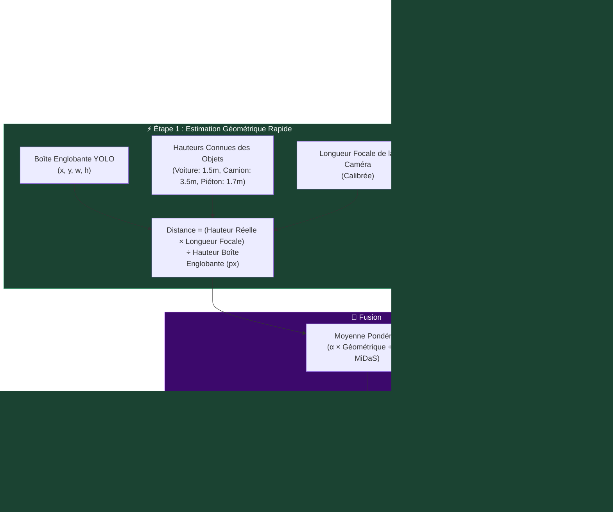
```mermaid
graph TB
    subgraph STAGE1["⚡ Étape 1 : Estimation Géométrique Rapide"]
        BBOX["Boîte Englobante YOLO<br/>(x, y, w, h)"]
        KNOWN["Hauteurs Connues des Objets<br/>(Voiture: 1.5m, Camion: 3.5m, Piéton: 1.7m)"]
        FOCAL["Longueur Focale de la Caméra<br/>(Calibrée)"]
        CALC["Distance = (Hauteur Réelle × Longueur Focale) <br/> ÷ Hauteur Boîte Englobante (px)"]
    end

    subgraph STAGE2["🧠 Étape 2 : Raffinement de Profondeur (MiDaS)"]
        FRAME["Image Complète"]
        MIDAS["MiDaS v3.1 DPT<br/>(Profondeur Monoculaire)"]
        DEPTHMAP["Carte de Profondeur Dense"]
        SAMPLE["Échantillonnage de Profondeur au<br/>Centre de l'Objet"]
    end

    subgraph FUSION["🔗 Fusion"]
        WEIGHTED["Moyenne Pondérée<br/>(α × Géométrique + β × MiDaS)"]
        KALMAN["Filtre de Kalman<br/>(Lissage Temporel)"]
        FINAL_DIST["Estimation Finale<br/>de Distance (mètres)"]
    end

    BBOX --> CALC
    KNOWN --> CALC
    FOCAL --> CALC
    FRAME --> MIDAS --> DEPTHMAP --> SAMPLE
    CALC --> WEIGHTED
    SAMPLE --> WEIGHTED
    WEIGHTED --> KALMAN --> FINAL_DIST

    style STAGE1 fill:#1b4332,stroke:#52b788,color:#fff
    style STAGE2 fill:#003049,stroke:#669bbc,color:#fff
    style FUSION fill:#3c096c,stroke:#c77dff,color:#fff
```

### 5.3 Paramètres de Calibration de la Caméra

```
Matrice Intrinsèque K :
┌              ┐
│ fx  0   cx   │
│ 0   fy  cy   │
│ 0   0   1    │
└              ┘

Où :
  fx, fy = Longueur focale (pixels)
  cx, cy = Point principal (centre de l'image)

Formule de Distance (Modèle Sténopé) :
  D = (H_réel × f_y) / h_bbox

Où :
  D       = Distance à l'objet (mètres)
  H_réel  = Hauteur réelle connue de l'objet (mètres)
  f_y     = Longueur focale en direction y (pixels)
  h_bbox  = Hauteur de la boîte englobante dans l'image (pixels)
```

### 5.4 Dimensions Connues des Objets (Table de Référence)

| Classe d'Objet | Hauteur Moy. (m) | Largeur Moy. (m) | Longueur Moy. (m) |
|----------------|-------------------|-------------------|---------------------|
| Voiture | 1.50 | 1.80 | 4.50 |
| Camion | 3.50 | 2.50 | 12.00 |
| Bus | 3.20 | 2.50 | 12.00 |
| Moto | 1.10 | 0.80 | 2.10 |
| Vélo | 1.00 | 0.60 | 1.80 |
| Piéton | 1.70 | 0.50 | 0.30 |
| Feu de Signalisation | 0.40 | 0.30 | 0.20 |
| Panneau Stop | 0.75 | 0.75 | — |

---

## 6. Module de Prise de Décision

### 6.1 Classification des Zones de Risque

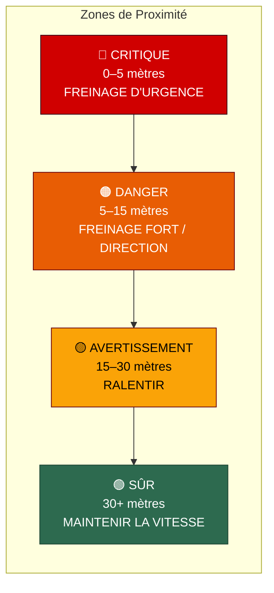
```mermaid
graph LR
    subgraph ZONES["Zones de Proximité"]
        CRIT["🔴 CRITIQUE<br/>0–5 mètres<br/>FREINAGE D'URGENCE"]
        DANGER["🟠 DANGER<br/>5–15 mètres<br/>FREINAGE FORT / DIRECTION"]
        WARNING["🟡 AVERTISSEMENT<br/>15–30 mètres<br/>RALENTIR"]
        SAFE["🟢 SÛR<br/>30+ mètres<br/>MAINTENIR LA VITESSE"]
    end

    CRIT --> DANGER --> WARNING --> SAFE

    style CRIT fill:#d00000,stroke:#370617,color:#fff
    style DANGER fill:#e85d04,stroke:#6a040f,color:#fff
    style WARNING fill:#faa307,stroke:#6a040f,color:#000
    style SAFE fill:#2d6a4f,stroke:#1b4332,color:#fff
```

### 6.2 Logique de l'Arbre de Décision

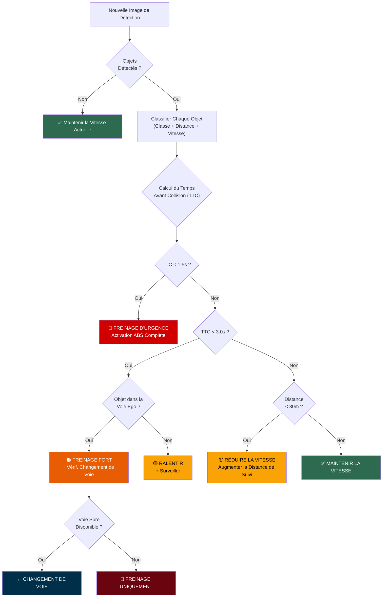
```mermaid
flowchart TD
    START["Nouvelle Image de Détection"] --> CHECK{"Objets<br/>Détectés ?"}
    CHECK -->|Non| MAINTAIN["✅ Maintenir la Vitesse Actuelle"]
    CHECK -->|Oui| CLASSIFY["Classifier Chaque Objet<br/>(Classe + Distance + Vitesse)"]
    
    CLASSIFY --> TTC{"Calcul du Temps<br/>Avant Collision (TTC)"}
    
    TTC --> TTC_CRIT{"TTC < 1.5s ?"}
    TTC_CRIT -->|Oui| EMERGENCY["🔴 FREINAGE D'URGENCE<br/>Activation ABS Complète"]
    TTC_CRIT -->|Non| TTC_WARN{"TTC < 3.0s ?"}
    
    TTC_WARN -->|Oui| ZONE_CHECK{"Objet dans la<br/>Voie Ego ?"}
    ZONE_CHECK -->|Oui| HARD_BRAKE["🟠 FREINAGE FORT<br/>+ Vérif. Changement de Voie"]
    ZONE_CHECK -->|Non| MONITOR["🟡 RALENTIR<br/>+ Surveiller"]
    
    TTC_WARN -->|Non| DIST_CHECK{"Distance<br/>< 30m ?"}
    DIST_CHECK -->|Oui| CAUTION["🟡 RÉDUIRE LA VITESSE<br/>Augmenter la Distance de Suivi"]
    DIST_CHECK -->|Non| MAINTAIN2["✅ MAINTENIR LA VITESSE"]

    HARD_BRAKE --> LANE{"Voie Sûre<br/>Disponible ?"}
    LANE -->|Oui| STEER["↔️ CHANGEMENT DE VOIE"]
    LANE -->|Non| BRAKE_ONLY["🛑 FREINAGE UNIQUEMENT"]

    style EMERGENCY fill:#d00000,color:#fff
    style HARD_BRAKE fill:#e85d04,color:#fff
    style MONITOR fill:#faa307,color:#000
    style CAUTION fill:#faa307,color:#000
    style MAINTAIN fill:#2d6a4f,color:#fff
    style MAINTAIN2 fill:#2d6a4f,color:#fff
    style STEER fill:#003049,color:#fff
    style BRAKE_ONLY fill:#6a040f,color:#fff
```

### 6.3 Formule du Temps Avant Collision (TTC)

```
TTC = Distance / Vitesse_Relative

Où :
  Distance          = Distance estimée à l'objet (mètres)
  Vitesse_Relative  = (V_ego - V_objet) en m/s
  
  Si Vitesse_Relative ≤ 0 → TTC = ∞ (l'objet s'éloigne ou même vitesse)
```

### 6.4 Logique de Décision pour les Feux de Signalisation

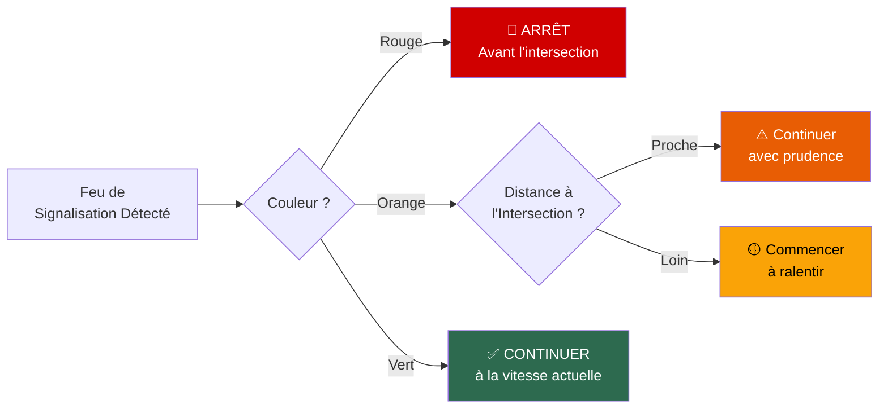
```mermaid
flowchart LR
    TL["Feu de<br/>Signalisation Détecté"] --> COLOR{"Couleur ?"}
    COLOR -->|Rouge| STOP["🛑 ARRÊT<br/>Avant l'intersection"]
    COLOR -->|Orange| ASSESS{"Distance à<br/>l'Intersection ?"}
    ASSESS -->|Proche| PROCEED["⚠️ Continuer<br/>avec prudence"]
    ASSESS -->|Loin| SLOW["🟡 Commencer<br/>à ralentir"]
    COLOR -->|Vert| GO["✅ CONTINUER<br/>à la vitesse actuelle"]

    style STOP fill:#d00000,color:#fff
    style SLOW fill:#faa307,color:#000
    style PROCEED fill:#e85d04,color:#fff
    style GO fill:#2d6a4f,color:#fff
```

---

## 7. Architecture du Pipeline Temps Réel

### 7.1 Pipeline de Traitement (Par Image)


```mermaid
gantt
    title Pipeline de Traitement d'Image (~33ms budget @ 30 FPS)
    dateFormat X
    axisFormat %Lms

    section Capture
    Capture Caméra          :cam, 0, 2

    section Prétraitement
    Redimensionnement + Norm :pre, 2, 4

    section Détection
    Inférence YOLO (GPU)    :det, 4, 14

    section Suivi
    Mise à jour Bot-SORT    :track, 14, 17

    section Distance
    Estimation de Profondeur :depth, 14, 22

    section Décision
    Évaluation des Risques   :risk, 22, 26
    Planification d'Action   :plan, 26, 29

    section Sortie
    Affichage + Actionneur   :out, 29, 33
```

### 7.2 Architecture Multi-Thread

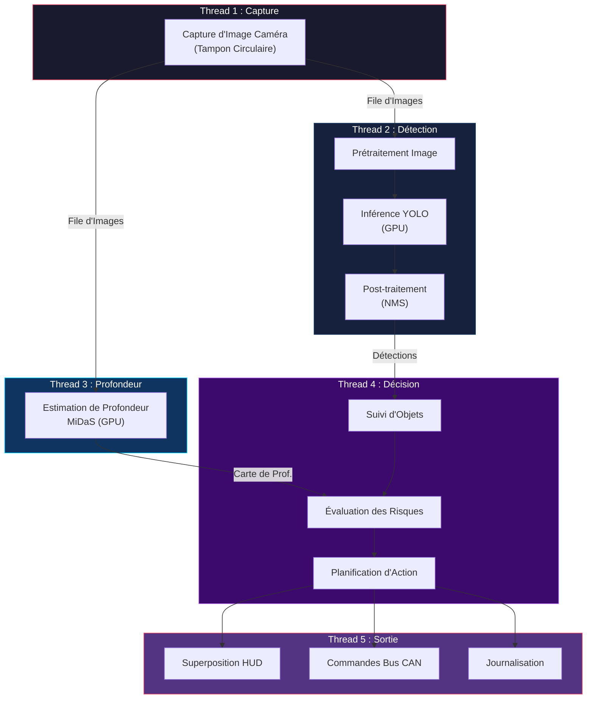
```mermaid
graph TB
    subgraph THREAD1["Thread 1 : Capture"]
        T1["Capture d'Image Caméra<br/>(Tampon Circulaire)"]
    end

    subgraph THREAD2["Thread 2 : Détection"]
        T2A["Prétraitement Image"]
        T2B["Inférence YOLO<br/>(GPU)"]
        T2C["Post-traitement<br/>(NMS)"]
    end

    subgraph THREAD3["Thread 3 : Profondeur"]
        T3["Estimation de Profondeur<br/>MiDaS (GPU)"]
    end

    subgraph THREAD4["Thread 4 : Décision"]
        T4A["Suivi d'Objets"]
        T4B["Évaluation des Risques"]
        T4C["Planification d'Action"]
    end

    subgraph THREAD5["Thread 5 : Sortie"]
        T5A["Superposition HUD"]
        T5B["Commandes Bus CAN"]
        T5C["Journalisation"]
    end

    T1 -->|File d'Images| T2A
    T2A --> T2B --> T2C
    T1 -->|File d'Images| T3
    T2C -->|Détections| T4A
    T3 -->|Carte de Prof.| T4B
    T4A --> T4B --> T4C
    T4C --> T5A
    T4C --> T5B
    T4C --> T5C

    style THREAD1 fill:#1a1a2e,stroke:#e94560,color:#fff
    style THREAD2 fill:#16213e,stroke:#0f3460,color:#fff
    style THREAD3 fill:#0f3460,stroke:#00d4ff,color:#fff
    style THREAD4 fill:#3c096c,stroke:#c77dff,color:#fff
    style THREAD5 fill:#533483,stroke:#e94560,color:#fff
```

---

## 8. Plan de Création du Dataset

### 8.1 Composition du Dataset

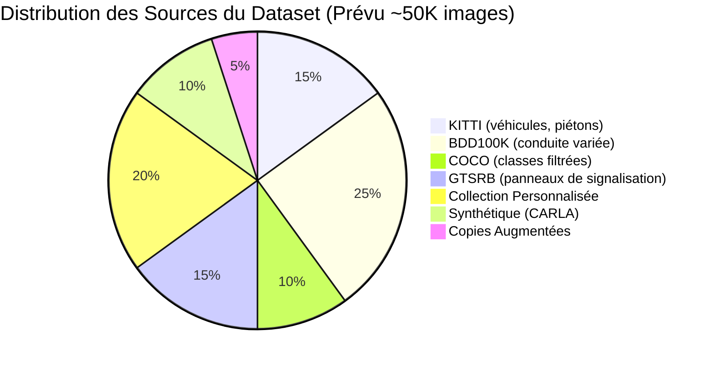
```mermaid
pie title Distribution des Sources du Dataset (Prévu ~50K images)
    "KITTI (véhicules, piétons)" : 15
    "BDD100K (conduite variée)" : 25
    "COCO (classes filtrées)" : 10
    "GTSRB (panneaux de signalisation)" : 15
    "Collection Personnalisée" : 20
    "Synthétique (CARLA)" : 10
    "Copies Augmentées" : 5
```

### 8.2 Processus de Création du Dataset Étape par Étape

#### Étape 1 : Collecter et Télécharger les Datasets Publics

| Dataset | Source | Classes Utilisées | Format |
|---------|--------|-------------------|--------|
| **KITTI** | [cvlibs.net/datasets/kitti](http://www.cvlibs.net/datasets/kitti/) | Voiture, Camion, Piéton, Cycliste | Format KITTI → convertir en YOLO |
| **BDD100K** | [bdd-data.berkeley.edu](https://bdd-data.berkeley.edu/) | Tous types de véhicules, piétons, feux | JSON → convertir en YOLO |
| **COCO 2017** | [cocodataset.org](https://cocodataset.org/) | voiture, camion, bus, moto, vélo, personne, feu, panneau stop | COCO JSON → convertir en YOLO |
| **GTSRB** | [benchmark.ini.rub.de](https://benchmark.ini.rub.de/) | Limitations de vitesse, stop, cédez le passage, sens interdit | Classification → créer labels de détection |
| **Mapillary Traffic Signs** | [mapillary.com/dataset/trafficsign](https://www.mapillary.com/dataset/trafficsign) | Panneaux de signalisation mondiaux | Convertir en YOLO |

#### Étape 2 : Collection de Données Personnalisées

```
Configuration d'Enregistrement :
  ├── Caméra : Dashcam ou caméra IP (1080p, 30 FPS, grand angle)
  ├── Montage : Centre du tableau de bord, orientée vers l'avant
  ├── Durée d'Enregistrement : 20+ heures de conduite variée
  └── Scénarios à Couvrir :
       ├── Conduite urbaine (intersections, piétons)
       ├── Conduite sur autoroute (haute vitesse, camions, changements de voie)
       ├── Routes de banlieue (résidentiel, écoles, parcs)
       ├── Conduite de nuit (phares, faible visibilité)
       ├── Conditions de pluie/brouillard
       └── Zones de travaux (cônes, barrières)
```

#### Étape 3 : Pipeline d'Annotation


```mermaid
flowchart LR
    RAW["Images Brutes<br/>(Collectées + Téléchargées)"] 
    --> FILTER["Filtrer & Sélectionner<br/>(Supprimer doublons,<br/>flou, mauvaise qualité)"]
    --> ANNOTATE["Annoter avec CVAT<br/>(Boîtes Englobantes<br/>+ Étiquettes de Classe)"]
    --> REVIEW["Revue de Qualité<br/>(Vérification croisée,<br/>correction d'erreurs)"]
    --> CONVERT["Convertir en Format<br/>YOLO<br/>(fichiers txt)"]
    --> SPLIT["Division Train/Val/Test<br/>(70/20/10)"]
    --> FINAL_DS["Dataset Final<br/>Prêt pour l'Entraînement"]

    style RAW fill:#003049,color:#fff
    style FILTER fill:#1b4332,color:#fff
    style ANNOTATE fill:#6a040f,color:#fff
    style REVIEW fill:#e85d04,color:#fff
    style CONVERT fill:#3c096c,color:#fff
    style SPLIT fill:#0f3460,color:#fff
    style FINAL_DS fill:#2d6a4f,color:#fff
```

#### Étape 4 : Structure du Format YOLO

```
dataset/
├── data.yaml                   # Configuration du dataset
├── train/
│   ├── images/
│   │   ├── img_00001.jpg
│   │   ├── img_00002.jpg
│   │   └── ...
│   └── labels/
│       ├── img_00001.txt       # <id_classe> <x_centre> <y_centre> <largeur> <hauteur>
│       ├── img_00002.txt
│       └── ...
├── val/
│   ├── images/
│   └── labels/
└── test/
    ├── images/
    └── labels/
```

**Format d'Étiquette YOLO** (normalisé 0–1) :
```
# <id_classe> <x_centre> <y_centre> <largeur> <hauteur>
0 0.4532 0.6210 0.1200 0.2500
5 0.7800 0.5500 0.0400 0.1800
7 0.2100 0.3000 0.0250 0.0600
```

#### Étape 5 : Configuration data.yaml

```yaml
# data.yaml - Configuration du dataset pour Ultralytics YOLO
path: ./dataset
train: train/images
val: val/images
test: test/images

# Nombre de classes
nc: 18

# Noms des classes
names:
  0: car
  1: truck
  2: bus
  3: motorcycle
  4: bicycle
  5: pedestrian
  6: cyclist
  7: traffic_light_red
  8: traffic_light_green
  9: traffic_light_yellow
  10: stop_sign
  11: speed_limit_sign
  12: yield_sign
  13: no_entry_sign
  14: road_barrier
  15: cone
  16: pothole
  17: crosswalk
```

### 8.3 Stratégie d'Augmentation de Données

| Augmentation | Paramètre | Objectif |
|-------------|-----------|----------|
| **Retournement Horizontal** | p=0.5 | Variations de conduite gauche/droite |
| **Décalage de Teinte HSV** | ±15° | Robustesse aux couleurs |
| **Saturation HSV** | ±40% | Variations d'éclairage |
| **Valeur HSV** | ±40% | Robustesse à la luminosité |
| **Mosaïque** | p=1.0 | Apprentissage multi-échelle, petits objets |
| **MixUp** | p=0.15 | Régularisation |
| **Copier-Coller** | p=0.1 | Augmentation des classes rares |
| **Perspective** | ±0.001 | Variations de point de vue |
| **Flou de Mouvement** | noyau=5 | Simuler un mouvement rapide |
| **Superposition Pluie/Brouillard** | Personnalisé | Robustesse aux conditions météo défavorables |

---

## 9. Stratégie d'Entraînement

### 9.1 Pipeline d'Entraînement

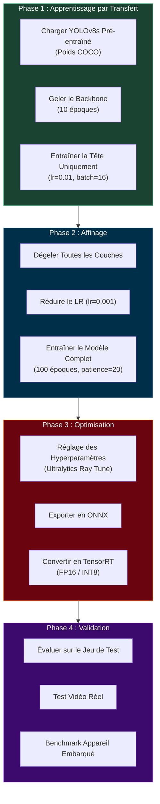
```mermaid
flowchart TD
    subgraph PHASE1["Phase 1 : Apprentissage par Transfert"]
        P1A["Charger YOLOv8s Pré-entraîné<br/>(Poids COCO)"]
        P1B["Geler le Backbone<br/>(10 époques)"]
        P1C["Entraîner la Tête Uniquement<br/>(lr=0.01, batch=16)"]
    end

    subgraph PHASE2["Phase 2 : Affinage"]
        P2A["Dégeler Toutes les Couches"]
        P2B["Réduire le LR (lr=0.001)"]
        P2C["Entraîner le Modèle Complet<br/>(100 époques, patience=20)"]
    end

    subgraph PHASE3["Phase 3 : Optimisation"]
        P3A["Réglage des Hyperparamètres<br/>(Ultralytics Ray Tune)"]
        P3B["Exporter en ONNX"]
        P3C["Convertir en TensorRT<br/>(FP16 / INT8)"]
    end

    subgraph PHASE4["Phase 4 : Validation"]
        P4A["Évaluer sur le Jeu de Test"]
        P4B["Test Vidéo Réel"]
        P4C["Benchmark Appareil Embarqué"]
    end

    PHASE1 --> PHASE2 --> PHASE3 --> PHASE4

    style PHASE1 fill:#1b4332,stroke:#52b788,color:#fff
    style PHASE2 fill:#003049,stroke:#669bbc,color:#fff
    style PHASE3 fill:#6a040f,stroke:#e85d04,color:#fff
    style PHASE4 fill:#3c096c,stroke:#c77dff,color:#fff
```

### 9.2 Environnement d'Entraînement Kaggle

> [!IMPORTANT]
> **Plateforme d'Entraînement :** Nous utilisons les **Notebooks Kaggle** avec accélérateurs GPU gratuits.
> - **Options GPU :** NVIDIA Tesla P100 (16 Go) ou T4 × 2 (2 × 16 Go)
> - **Limite de Session :** 30 heures/semaine de GPU, session max de 12 heures
> - **Disque :** 20 Go persistant + 70 Go temporaire
> - **RAM :** 13 Go (CPU) / 13 Go (mode GPU)
> - **Intégration Dataset :** Les Datasets Kaggle sont montés à `/kaggle/input/`

#### Configuration du Notebook Kaggle

```python
# ============================================================
# NOTEBOOK KAGGLE — Entraînement YOLO pour la Conduite Autonome
# ============================================================
# Paramètres → Accélérateur → GPU T4 x2 (ou P100)
# Paramètres → Internet → ACTIVÉ (pour télécharger les poids pré-entraînés)
# ============================================================

# Étape 1 : Installer Ultralytics (pré-installé sur Kaggle, mettre à jour)
!pip install -q ultralytics --upgrade

# Étape 2 : Vérifier la disponibilité du GPU
import torch
print(f"GPU Disponible : {torch.cuda.is_available()}")
print(f"Nom du GPU : {torch.cuda.get_device_name(0)}")
print(f"Mémoire GPU : {torch.cuda.get_device_properties(0).total_mem / 1e9:.1f} Go")

# Étape 3 : Lier au Dataset Kaggle
# Téléchargez votre dataset en tant que Dataset Kaggle, puis ajoutez-le au notebook.
# Il sera disponible à : /kaggle/input/<nom-du-dataset>/
import os
DATASET_PATH = "/kaggle/input/driving-object-detection"  # Votre dataset Kaggle
OUTPUT_PATH = "/kaggle/working"                           # Répertoire de sortie
```

#### Configuration d'Entraînement (Optimisée pour Kaggle)

```python
from ultralytics import YOLO

# Phase 1 : Apprentissage par Transfert sur Kaggle
model = YOLO("yolov8s.pt")  # Téléchargement auto des poids COCO pré-entraînés

results = model.train(
    data=f"{DATASET_PATH}/data.yaml",
    epochs=100,
    imgsz=640,
    batch=16,              # Adapté pour 16 Go VRAM P100/T4
    patience=20,
    optimizer="AdamW",
    lr0=0.01,
    lrf=0.01,              # Facteur de taux d'apprentissage final
    momentum=0.937,
    weight_decay=0.0005,
    warmup_epochs=3,
    warmup_momentum=0.8,
    warmup_bias_lr=0.1,
    
    # Augmentation
    hsv_h=0.015,           # Augmentation de teinte
    hsv_s=0.7,             # Augmentation de saturation
    hsv_v=0.4,             # Augmentation de valeur
    degrees=0.0,           # Rotation
    translate=0.1,         # Translation
    scale=0.5,             # Échelle
    fliplr=0.5,            # Retournement horizontal
    mosaic=1.0,            # Augmentation mosaïque
    mixup=0.15,            # Augmentation MixUp
    copy_paste=0.1,        # Augmentation Copier-Coller
    
    # Matériel — GPU Kaggle
    device=0,              # GPU 0 (P100 ou T4)
    workers=2,             # Kaggle a peu de cœurs CPU
    
    # Sauvegarde — sortie vers /kaggle/working/ (téléchargeable)
    project=f"{OUTPUT_PATH}/runs/train",
    name="driving_detector_v1",
    save=True,
    save_period=10,        # Point de contrôle toutes les 10 époques
    plots=True,
)

# Étape 4 : Télécharger les meilleurs poids après l'entraînement
# Le meilleur modèle sera sauvegardé à :
# /kaggle/working/runs/train/driving_detector_v1/weights/best.pt
# → Cliquez "Save Version" → "Save & Run All" pour conserver les sorties
print(f"Meilleur modèle sauvegardé à : {OUTPUT_PATH}/runs/train/driving_detector_v1/weights/best.pt")
```

### 9.3 Conseils de Gestion de Session Kaggle

> [!WARNING]
> Les sessions Kaggle expirent après **12 heures maximum**. Planifiez votre stratégie d'entraînement en conséquence :

| Conseil | Description |
|---------|-------------|
| **Utiliser `save_period=10`** | Sauvegarder les points de contrôle toutes les 10 époques pour reprendre si la session expire |
| **Reprendre l'entraînement** | Utiliser `model = YOLO("last.pt")` puis `model.train(resume=True)` pour continuer |
| **Diviser l'entraînement** | Phase 1 (backbone gelé, 10 époques) dans une session, Phase 2 (affinage, 100 époques) sur plusieurs sessions |
| **Sauvegarder les sorties** | Cliquer **"Save Version"** → **"Save & Run All"** pour conserver les poids `best.pt` |
| **Utiliser les Datasets Kaggle** | Télécharger votre dataset comme Dataset Kaggle pour un accès instantané `/kaggle/input/` |
| **Surveiller l'utilisation GPU** | Utiliser `!nvidia-smi` périodiquement pour vérifier l'utilisation VRAM |

#### Reprise d'Entraînement Entre Sessions

```python
from ultralytics import YOLO

# Si la session a expiré en cours d'entraînement, reprendre depuis le dernier checkpoint :
# 1. Télécharger last.pt depuis la sortie de la session précédente
# 2. Le téléverser comme Dataset Kaggle ou l'ajouter aux fichiers du notebook
# 3. Reprendre :

model = YOLO("/kaggle/input/previous-run/last.pt")  # Charger le checkpoint
results = model.train(resume=True)                    # Continue depuis l'arrêt
```

### 9.4 Réglage des Hyperparamètres

```python
# Réglage automatique des hyperparamètres avec Ray Tune (sur Kaggle)
# Note : Ceci est gourmand en ressources ; réduire les itérations sur le tier gratuit
model = YOLO("yolov8s.pt")
result_grid = model.tune(
    data=f"{DATASET_PATH}/data.yaml",
    epochs=30,
    iterations=20,         # Réduit pour les limites de temps Kaggle
    optimizer="AdamW",
    plots=True,
    save=True,
    val=True,
)
```

---

## 10. Déploiement & Intégration Embarquée

### 10.1 Architecture de Déploiement

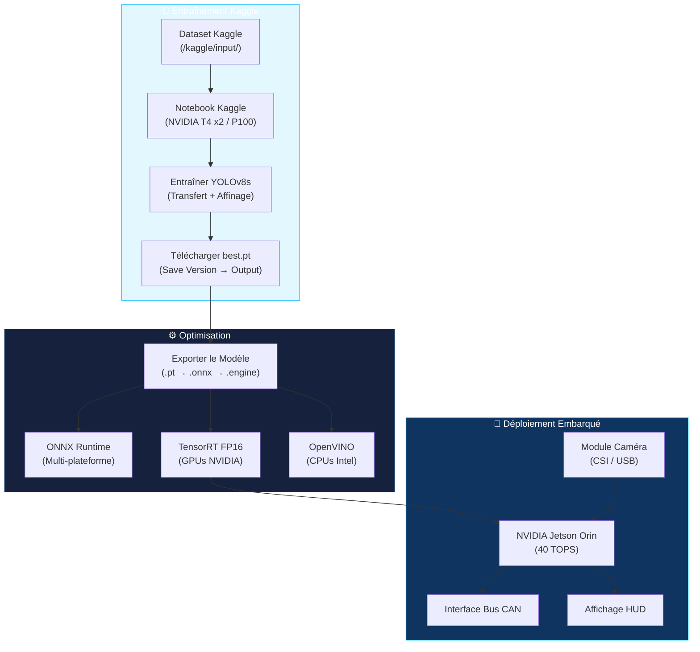
```mermaid
graph TB
    subgraph KAGGLE["📓 Entraînement Kaggle"]
        NOTEBOOK["Notebook Kaggle<br/>(NVIDIA T4 x2 / P100)"]
        KAGGLE_DS["Dataset Kaggle<br/>(/kaggle/input/)"]
        TRAIN["Entraîner YOLOv8s<br/>(Transfert + Affinage)"]
        DOWNLOAD["Télécharger best.pt<br/>(Save Version → Output)"]
    end

    subgraph OPTIMIZATION["⚙️ Optimisation"]
        EXPORT["Exporter le Modèle<br/>(.pt → .onnx → .engine)"]
        ONNX["ONNX Runtime<br/>(Multi-plateforme)"]
        TRT["TensorRT FP16<br/>(GPUs NVIDIA)"]
        OPENVINO["OpenVINO<br/>(CPUs Intel)"]
    end

    subgraph EDGE["🚗 Déploiement Embarqué"]
        JETSON["NVIDIA Jetson Orin<br/>(40 TOPS)"]
        CAMERA["Module Caméra<br/>(CSI / USB)"]
        CAN["Interface Bus CAN"]
        HUD["Affichage HUD"]
    end

    KAGGLE_DS --> NOTEBOOK
    NOTEBOOK --> TRAIN
    TRAIN --> DOWNLOAD
    DOWNLOAD --> EXPORT
    EXPORT --> ONNX
    EXPORT --> TRT
    EXPORT --> OPENVINO
    TRT --> JETSON
    CAMERA --> JETSON
    JETSON --> CAN
    JETSON --> HUD

    style KAGGLE fill:#20beff20,stroke:#20beff,color:#fff
    style OPTIMIZATION fill:#16213e,stroke:#0f3460,color:#fff
    style EDGE fill:#0f3460,stroke:#00d4ff,color:#fff
```

### 10.2 Commandes d'Export du Modèle

```python
from ultralytics import YOLO

# Charger le meilleur modèle (téléchargé depuis la sortie Kaggle)
model = YOLO("best.pt")  # Téléchargé depuis la sortie du notebook Kaggle

# Exporter en ONNX (peut être fait sur Kaggle ou localement)
model.export(format="onnx", imgsz=640, half=True, simplify=True)

# Exporter en TensorRT (pour NVIDIA Jetson — faire ceci sur l'appareil Jetson)
model.export(format="engine", imgsz=640, half=True, device=0)

# Exporter en OpenVINO (pour Intel)
model.export(format="openvino", imgsz=640, half=True)
```

### 10.3 Spécifications du Matériel Embarqué

| Caractéristique | Jetson Orin Nano | Jetson Orin NX | Jetson AGX Orin |
|-----------------|------------------|----------------|-----------------|
| **Performance IA** | 40 TOPS | 100 TOPS | 275 TOPS |
| **GPU** | 1024 cœurs Ampere | 1024 cœurs Ampere | 2048 cœurs Ampere |
| **CPU** | 6 cœurs Cortex-A78 | 8 cœurs Cortex-A78 | 12 cœurs Cortex-A78 |
| **RAM** | 8 Go | 16 Go | 64 Go |
| **YOLOv8s FPS** | ~35 FPS | ~60 FPS | ~90+ FPS |
| **Prix (Est.)** | 199 $ | 399 $ | 999 $ |
| **Recommandé** | ✅ Budget | ✅ **Meilleur Rapport Qualité/Prix** | Premium |

---

## 11. Phases de Développement & Calendrier

### 11.1 Aperçu des Phases (Diagramme de Gantt)

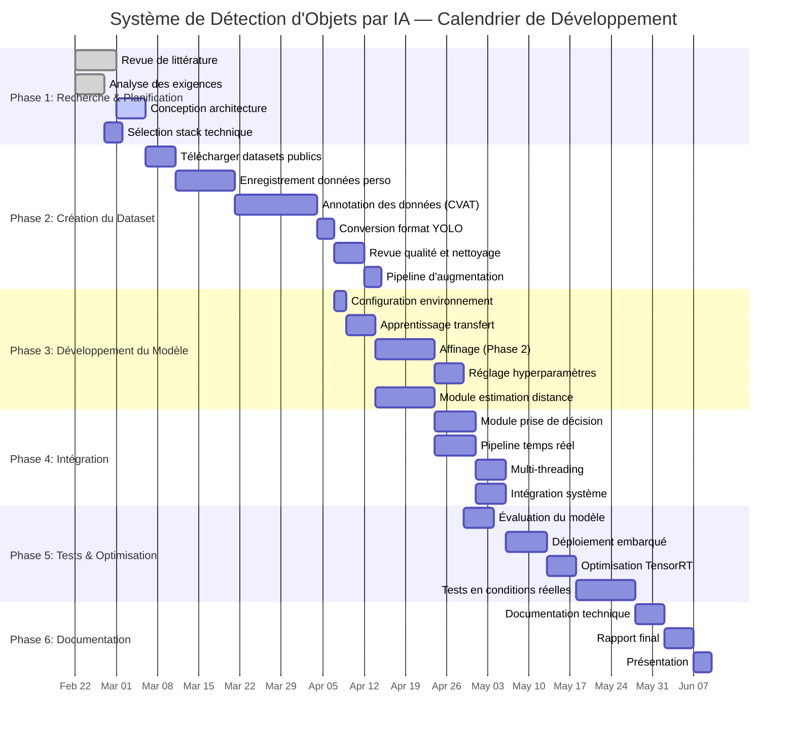
```mermaid
gantt
    title Système de Détection d'Objets par IA — Calendrier de Développement
    dateFormat YYYY-MM-DD
    axisFormat %b %d

    section Phase 1: Recherche & Planification
    Revue de littérature        :done, p1a, 2026-02-22, 7d
    Analyse des exigences       :done, p1b, 2026-02-22, 5d
    Conception architecture     :active, p1c, after p1a, 5d
    Sélection stack technique   :p1d, after p1b, 3d

    section Phase 2: Création du Dataset
    Télécharger datasets publics :p2a, after p1c, 5d
    Enregistrement données perso :p2b, after p2a, 10d
    Annotation des données (CVAT):p2c, after p2b, 14d
    Conversion format YOLO      :p2d, after p2c, 3d
    Revue qualité et nettoyage  :p2e, after p2d, 5d
    Pipeline d'augmentation     :p2f, after p2e, 3d

    section Phase 3: Développement du Modèle
    Configuration environnement :p3a, after p2d, 2d
    Apprentissage transfert     :p3b, after p3a, 5d
    Affinage (Phase 2)          :p3c, after p3b, 10d
    Réglage hyperparamètres     :p3d, after p3c, 5d
    Module estimation distance  :p3e, after p3b, 10d

    section Phase 4: Intégration
    Module prise de décision    :p4a, after p3c, 7d
    Pipeline temps réel         :p4b, after p3e, 7d
    Multi-threading             :p4c, after p4b, 5d
    Intégration système         :p4d, after p4a, 5d

    section Phase 5: Tests & Optimisation
    Évaluation du modèle        :p5a, after p3d, 5d
    Déploiement embarqué        :p5b, after p4d, 7d
    Optimisation TensorRT       :p5c, after p5b, 5d
    Tests en conditions réelles :p5d, after p5c, 10d

    section Phase 6: Documentation
    Documentation technique     :p6a, after p5d, 5d
    Rapport final               :p6b, after p6a, 5d
    Présentation                :p6c, after p6b, 3d
```

### 11.2 Détail des Phases

#### 📌 Phase 1 : Recherche & Planification (Semaines 1–2)

| Tâche | Description | Livrable |
|-------|-------------|----------|
| 1.1 | Revue des articles YOLO et documentation Ultralytics | Document de revue de littérature |
| 1.2 | Étude des méthodes d'estimation de distance (monoculaire, stéréo) | Matrice de comparaison |
| 1.3 | Analyse des datasets existants pour la conduite autonome | Rapport de sélection de datasets |
| 1.4 | Conception de l'architecture système (tous les modules) | Diagrammes d'architecture |
| 1.5 | Définition des classes d'objets et des exigences | Tableau de spécification des classes |
| 1.6 | Sélection du matériel et du stack logiciel | Document du stack technologique |

#### 📌 Phase 2 : Création du Dataset (Semaines 3–7)

| Tâche | Description | Livrable |
|-------|-------------|----------|
| 2.1 | Télécharger et prétraiter le dataset KITTI | Sous-ensemble KITTI au format YOLO |
| 2.2 | Télécharger et prétraiter le dataset BDD100K | Sous-ensemble BDD100K au format YOLO |
| 2.3 | Filtrer les classes COCO pertinentes | Sous-ensemble COCO au format YOLO |
| 2.4 | Télécharger et prétraiter GTSRB | Labels de détection de panneaux |
| 2.5 | Enregistrer des séquences de conduite personnalisées (20+ heures) | Enregistrements vidéo bruts |
| 2.6 | Extraire des images des enregistrements (2 FPS) | ~144K images brutes |
| 2.7 | Sélectionner et filtrer les meilleures images | ~10K images sélectionnées |
| 2.8 | Annoter avec CVAT (boîtes englobantes) | Fichiers de labels YOLO |
| 2.9 | Fusionner tous les datasets + unifier le mappage de classes | `data.yaml` unifié |
| 2.10 | Division Train/Val/Test 70/20/10 | Dataset final (~50K images) |
| 2.11 | Appliquer le pipeline d'augmentation | Jeu d'entraînement augmenté |

#### 📌 Phase 3 : Développement du Modèle (Semaines 5–9)

| Tâche | Description | Livrable |
|-------|-------------|----------|
| 3.1 | Configurer le Notebook Kaggle avec accélérateur GPU + téléverser le dataset | Environnement Kaggle fonctionnel |
| 3.2 | Entraîner YOLOv8s avec backbone gelé (10 époques) | Poids Phase 1 |
| 3.3 | Affiner le modèle complet (100 époques) | Meilleurs poids Phase 2 |
| 3.4 | Lancer le réglage d'hyperparamètres (Ray Tune) | Hyperparamètres optimaux |
| 3.5 | Implémenter le module de calibration caméra | Outil de calibration |
| 3.6 | Implémenter l'estimateur de distance géométrique | Module distance v1 |
| 3.7 | Intégrer la profondeur monoculaire MiDaS | Module distance v2 |
| 3.8 | Implémenter le filtre de Kalman pour le lissage de distance | Distances lissées |

#### 📌 Phase 4 : Intégration (Semaines 8–11)

| Tâche | Description | Livrable |
|-------|-------------|----------|
| 4.1 | Implémenter le classificateur de zones de risque | Module d'évaluation des risques |
| 4.2 | Implémenter le calculateur TTC | Prédiction de collision |
| 4.3 | Implémenter le planificateur d'action (freiner/diriger/avancer) | Moteur de décision |
| 4.4 | Construire le pipeline vidéo temps réel | Inférence en streaming |
| 4.5 | Ajouter le suivi Bot-SORT / ByteTrack | Suivi multi-objets |
| 4.6 | Implémenter le pipeline multi-thread | Débit optimisé |
| 4.7 | Construire la superposition HUD (visualisation OpenCV) | Sortie visuelle |
| 4.8 | Tests d'intégration système | Prototype intégré |

#### 📌 Phase 5 : Tests & Optimisation (Semaines 10–14)

| Tâche | Description | Livrable |
|-------|-------------|----------|
| 5.1 | Évaluer mAP, précision, rappel sur le jeu de test | Rapport de performance |
| 5.2 | Profiler la vitesse d'inférence sur le matériel cible | Benchmarks de latence |
| 5.3 | Exporter en ONNX et TensorRT | Fichiers de modèle optimisés |
| 5.4 | Benchmark sur appareil Jetson | Mesures FPS |
| 5.5 | Tester sur des vidéos de conduite réelles | Analyse qualitative |
| 5.6 | Tests de stress (nuit, pluie, éblouissement) | Rapport de cas limites |
| 5.7 | Améliorer itérativement (réentraîner sur les échecs) | Modèle amélioré |

#### 📌 Phase 6 : Documentation & Présentation (Semaines 14–16)

| Tâche | Description | Livrable |
|-------|-------------|----------|
| 6.1 | Rédiger la documentation technique | Documentation technique complète |
| 6.2 | Créer des tableaux comparatifs de performance | Rapport de benchmark |
| 6.3 | Préparer le rapport final du projet (PFE) | Rapport de projet |
| 6.4 | Créer les diapositives de présentation | Présentation de soutenance |
| 6.5 | Enregistrer une vidéo de démonstration | Vidéo de démonstration |

---

## 12. Analyse des Risques & Atténuation

### 12.1 Matrice des Risques

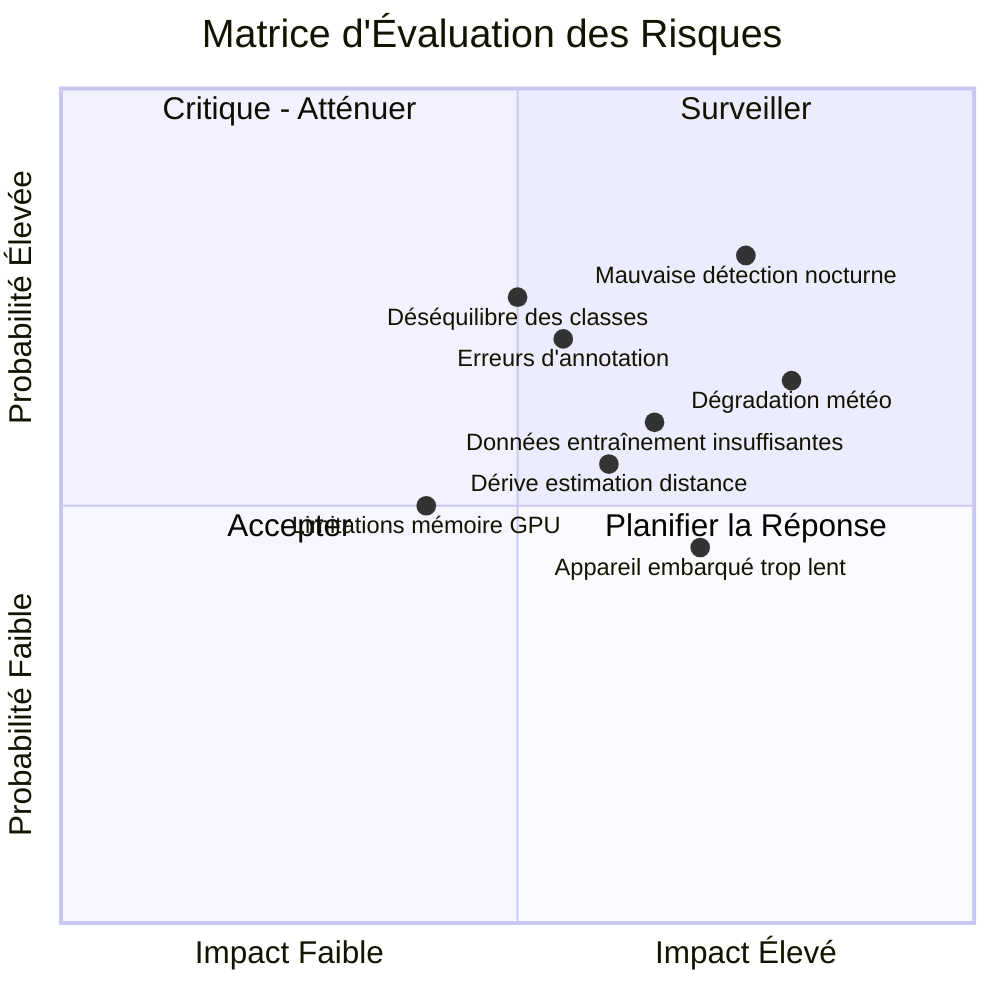
```mermaid
quadrantChart
    title Matrice d'Évaluation des Risques
    x-axis Impact Faible --> Impact Élevé
    y-axis Probabilité Faible --> Probabilité Élevée
    quadrant-1 Surveiller
    quadrant-2 Critique - Atténuer
    quadrant-3 Accepter
    quadrant-4 Planifier la Réponse
    "Mauvaise détection nocturne": [0.75, 0.80]
    "Données entraînement insuffisantes": [0.65, 0.60]
    "Limitations mémoire GPU": [0.40, 0.50]
    "Appareil embarqué trop lent": [0.70, 0.45]
    "Erreurs d'annotation": [0.55, 0.70]
    "Dégradation météo": [0.80, 0.65]
    "Déséquilibre des classes": [0.50, 0.75]
    "Dérive estimation distance": [0.60, 0.55]
```

### 12.2 Stratégies d'Atténuation des Risques

| Risque | Impact | Probabilité | Atténuation |
|--------|--------|-------------|-------------|
| **Mauvaise détection nocturne** | Élevé | Élevée | Ajouter des données spécifiques de nuit, envisager caméra IR |
| **Dégradation météorologique** | Élevé | Moyenne | Augmenter avec pluie/brouillard, utiliser le simulateur CARLA |
| **Données insuffisantes** | Élevé | Moyenne | Utiliser l'apprentissage par transfert, exploiter les grands datasets publics |
| **Déséquilibre des classes** | Moyen | Élevée | Sur-échantillonner les classes rares, utiliser la focal loss, augmentation copier-coller |
| **Erreurs d'annotation** | Moyen | Élevée | Revue multi-personnes, outils d'annotation semi-automatique |
| **Vitesse appareil embarqué** | Élevé | Moyenne | TensorRT FP16, réduire la taille d'entrée, élaguer le modèle |
| **Dérive d'estimation de distance** | Moyen | Moyenne | Filtrage de Kalman, fusion de capteurs, recalibration régulière |
| **Limites mémoire GPU** | Moyen | Moyenne | Accumulation de gradient, entraînement en précision mixte (FP16) |

---

## 13. Métriques d'Évaluation

### 13.1 Métriques de Détection d'Objets

| Métrique | Formule | Cible |
|----------|---------|-------|
| **mAP@0.5** | Précision Moyenne à IoU 0.5 | ≥ 0.85 |
| **mAP@0.5:0.95** | mAP sur plusieurs seuils IoU | ≥ 0.60 |
| **Précision** | VP / (VP + FP) | ≥ 0.90 |
| **Rappel** | VP / (VP + FN) | ≥ 0.85 |
| **Score F1** | 2 × (P × R) / (P + R) | ≥ 0.87 |
| **FPS** | Images traitées par seconde | ≥ 30 |
| **Latence** | Temps d'inférence de bout en bout | ≤ 33ms |

### 13.2 Métriques d'Estimation de Distance

| Métrique | Description | Cible |
|----------|-------------|-------|
| **EAM** | Erreur Absolue Moyenne (mètres) | ≤ 2.0m |
| **RMSE** | Racine de l'Erreur Quadratique Moyenne | ≤ 3.0m |
| **Err. Relative** | |Prédit - Réel| / Réel × 100 | ≤ 10% |
| **δ < 1.25** | % de prédictions à 1.25× de la vérité terrain | ≥ 85% |

### 13.3 Métriques au Niveau Système

| Métrique | Description | Cible |
|----------|-------------|-------|
| **FPS de Bout en Bout** | Débit complet du pipeline | ≥ 30 FPS |
| **Latence de Décision** | Temps de la détection au signal d'action | ≤ 50ms |
| **Taux de Fausses Alertes** | Freinages d'urgence inutiles / heure | ≤ 1 |
| **Taux de Manque** | Objets critiques non détectés | ≤ 2% |
| **Consommation** | Consommation électrique de l'appareil | ≤ 30W |

---

## 14. Structure du Répertoire du Projet

```
PFE/
├── README.md                          # Aperçu du projet
├── requirements.txt                   # Dépendances Python
├── data.yaml                          # Configuration du dataset
│
├── dataset/                           # Données d'entraînement
│   ├── train/
│   │   ├── images/
│   │   └── labels/
│   ├── val/
│   │   ├── images/
│   │   └── labels/
│   └── test/
│       ├── images/
│       └── labels/
│
├── scripts/                           # Scripts utilitaires
│   ├── convert_kitti_to_yolo.py       # Convertisseur format KITTI
│   ├── convert_bdd_to_yolo.py         # Convertisseur format BDD100K
│   ├── convert_coco_to_yolo.py        # Convertisseur format COCO
│   ├── augmentation_pipeline.py       # Augmentations personnalisées
│   ├── camera_calibration.py          # Outil de calibration caméra
│   └── visualize_annotations.py       # Visualisation des labels
│
├── src/                               # Code source
│   ├── detection/
│   │   ├── detector.py                # Wrapper de détection YOLO
│   │   └── tracker.py                 # Suivi d'objets (Bot-SORT)
│   ├── distance/
│   │   ├── geometric_estimator.py     # Distance modèle sténopé
│   │   ├── midas_estimator.py         # Estimation profondeur MiDaS
│   │   ├── fusion.py                  # Module de fusion de distance
│   │   └── kalman_filter.py           # Lissage temporel
│   ├── decision/
│   │   ├── risk_assessor.py           # Score de risque par zone
│   │   ├── ttc_calculator.py          # Temps avant collision
│   │   └── action_planner.py          # Décisions d'action de conduite
│   ├── pipeline/
│   │   ├── realtime_pipeline.py       # Pipeline principal temps réel
│   │   ├── video_capture.py           # Capture multi-thread
│   │   └── hud_overlay.py             # Rendu visuel HUD
│   └── utils/
│       ├── config.py                  # Gestion de configuration
│       ├── logger.py                  # Utilitaires de journalisation
│       └── visualization.py           # Visualisation de débogage
│
├── configs/                           # Fichiers de configuration
│   ├── model_config.yaml              # Hyperparamètres du modèle
│   ├── camera_params.yaml             # Paramètres intrinsèques
│   └── decision_thresholds.yaml       # Seuils des zones de risque
│
├── runs/                              # Sorties d'entraînement
│   └── train/
│       └── driving_detector_v1/
│           ├── weights/
│           │   ├── best.pt
│           │   └── last.pt
│           └── results.csv
│
├── exports/                           # Modèles exportés
│   ├── best.onnx
│   ├── best.engine                    # TensorRT
│   └── best_openvino/                 # OpenVINO
│
├── notebooks/                         # Notebooks Jupyter
│   ├── 01_data_exploration.ipynb
│   ├── 02_training_analysis.ipynb
│   └── 03_distance_calibration.ipynb
│
├── tests/                             # Tests unitaires
│   ├── test_detector.py
│   ├── test_distance.py
│   └── test_decision.py
│
└── docs/                              # Documentation
    ├── architecture.md
    ├── dataset_guide.md
    └── deployment_guide.md
```

---

## 15. Diagramme de Classes (Conception Logicielle)

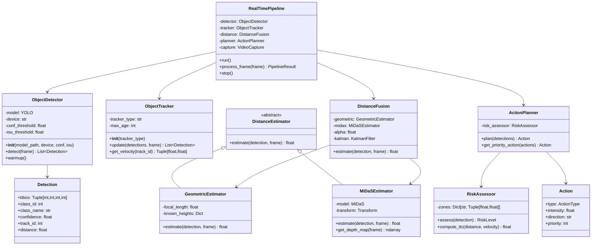
```mermaid
classDiagram
    class ObjectDetector {
        -model: YOLO
        -device: str
        -conf_threshold: float
        -iou_threshold: float
        +__init__(model_path, device, conf, iou)
        +detect(frame) List~Detection~
        +warmup()
    }

    class Detection {
        +bbox: Tuple[int,int,int,int]
        +class_id: int
        +class_name: str
        +confidence: float
        +track_id: int
        +distance: float
    }

    class ObjectTracker {
        -tracker_type: str
        -max_age: int
        +__init__(tracker_type)
        +update(detections, frame) List~Detection~
        +get_velocity(track_id) Tuple[float,float]
    }

    class DistanceEstimator {
        <<abstract>>
        +estimate(detection, frame) float
    }

    class GeometricEstimator {
        -focal_length: float
        -known_heights: Dict
        +estimate(detection, frame) float
    }

    class MiDaSEstimator {
        -model: MiDaS
        -transform: Transform
        +estimate(detection, frame) float
        +get_depth_map(frame) ndarray
    }

    class DistanceFusion {
        -geometric: GeometricEstimator
        -midas: MiDaSEstimator
        -alpha: float
        -kalman: KalmanFilter
        +estimate(detection, frame) float
    }

    class RiskAssessor {
        -zones: Dict[str, Tuple[float,float]]
        +assess(detection) RiskLevel
        +compute_ttc(distance, velocity) float
    }

    class ActionPlanner {
        -risk_assessor: RiskAssessor
        +plan(detections) Action
        +get_priority_action(actions) Action
    }

    class Action {
        +type: ActionType
        +intensity: float
        +direction: str
        +priority: int
    }

    class RealTimePipeline {
        -detector: ObjectDetector
        -tracker: ObjectTracker
        -distance: DistanceFusion
        -planner: ActionPlanner
        -capture: VideoCapture
        +run()
        +process_frame(frame) PipelineResult
        +stop()
    }

    DistanceEstimator <|-- GeometricEstimator
    DistanceEstimator <|-- MiDaSEstimator
    DistanceFusion --> GeometricEstimator
    DistanceFusion --> MiDaSEstimator
    RealTimePipeline --> ObjectDetector
    RealTimePipeline --> ObjectTracker
    RealTimePipeline --> DistanceFusion
    RealTimePipeline --> ActionPlanner
    ActionPlanner --> RiskAssessor
    ObjectDetector --> Detection
    ActionPlanner --> Action
```

---

## 16. Diagramme de Cas d'Utilisation

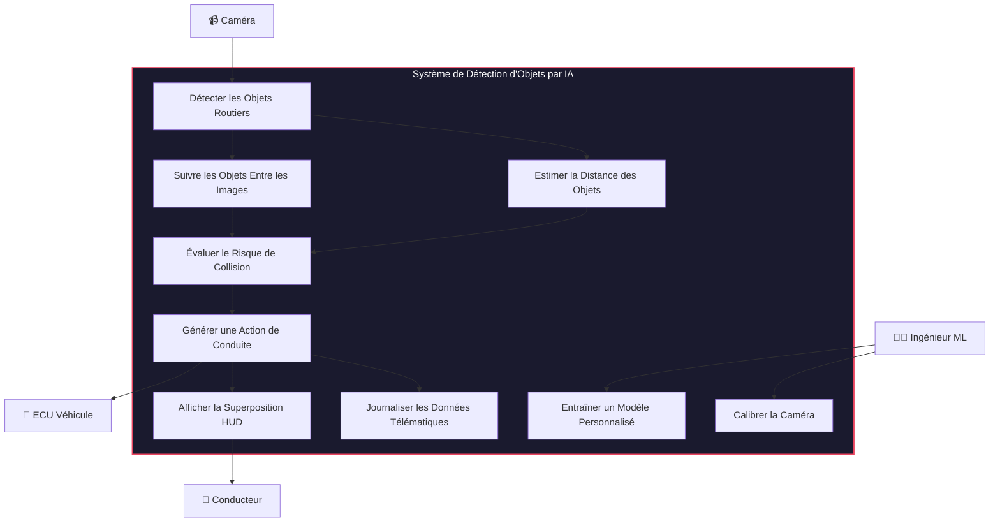
```mermaid
graph TB
    subgraph SYSTEM["Système de Détection d'Objets par IA"]
        UC1["Détecter les Objets Routiers"]
        UC2["Suivre les Objets Entre les Images"]
        UC3["Estimer la Distance des Objets"]
        UC4["Évaluer le Risque de Collision"]
        UC5["Générer une Action de Conduite"]
        UC6["Afficher la Superposition HUD"]
        UC7["Journaliser les Données Télématiques"]
        UC8["Entraîner un Modèle Personnalisé"]
        UC9["Calibrer la Caméra"]
    end

    DRIVER["🧑 Conducteur"]
    VEHICLE["🚗 ECU Véhicule"]
    ENGINEER["👨‍💻 Ingénieur ML"]
    CAMERA["📹 Caméra"]

    CAMERA --> UC1
    UC1 --> UC2
    UC1 --> UC3
    UC2 --> UC4
    UC3 --> UC4
    UC4 --> UC5
    UC5 --> VEHICLE
    UC5 --> UC6
    UC6 --> DRIVER
    UC5 --> UC7
    ENGINEER --> UC8
    ENGINEER --> UC9

    style SYSTEM fill:#1a1a2e,stroke:#e94560,color:#fff,stroke-width:2px
```

---

## 17. Diagramme de Déploiement

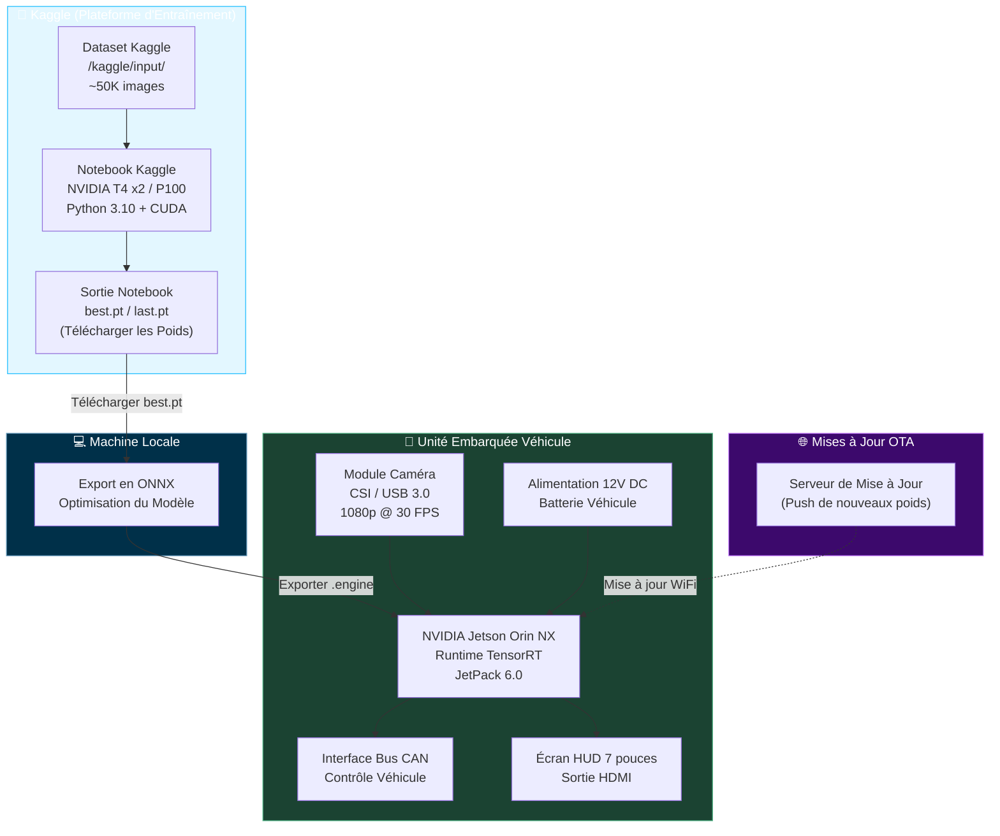
```mermaid
graph TB
    subgraph KAGGLE["📓 Kaggle (Plateforme d'Entraînement)"]
        KAGGLE_NB["Notebook Kaggle<br/>NVIDIA T4 x2 / P100<br/>Python 3.10 + CUDA"]
        KAGGLE_DS["Dataset Kaggle<br/>/kaggle/input/<br/>~50K images"]
        KAGGLE_OUT["Sortie Notebook<br/>best.pt / last.pt<br/>(Télécharger les Poids)"]
    end

    subgraph LOCAL["💻 Machine Locale"]
        EXPORT_LOCAL["Export en ONNX<br/>Optimisation du Modèle"]
    end

    subgraph EDGE["🚗 Unité Embarquée Véhicule"]
        JETSON["NVIDIA Jetson Orin NX<br/>Runtime TensorRT<br/>JetPack 6.0"]
        CAM["Module Caméra<br/>CSI / USB 3.0<br/>1080p @ 30 FPS"]
        CANBUS["Interface Bus CAN<br/>Contrôle Véhicule"]
        DISPLAY["Écran HUD 7 pouces<br/>Sortie HDMI"]
        POWER["Alimentation 12V DC<br/>Batterie Véhicule"]
    end

    subgraph NETWORK["🌐 Mises à Jour OTA"]
        OTA["Serveur de Mise à Jour<br/>(Push de nouveaux poids)"]
    end

    KAGGLE_DS --> KAGGLE_NB
    KAGGLE_NB --> KAGGLE_OUT
    KAGGLE_OUT --> |Télécharger best.pt| EXPORT_LOCAL
    EXPORT_LOCAL --> |Exporter .engine| JETSON
    CAM --> JETSON
    JETSON --> CANBUS
    JETSON --> DISPLAY
    POWER --> JETSON
    OTA -.-> |Mise à jour WiFi| JETSON

    style KAGGLE fill:#20beff20,stroke:#20beff,color:#fff
    style LOCAL fill:#003049,stroke:#669bbc,color:#fff
    style EDGE fill:#1b4332,stroke:#52b788,color:#fff
    style NETWORK fill:#3c096c,stroke:#c77dff,color:#fff
```

---

## 18. Diagramme d'Activité (Boucle Principale de Détection)

```mermaid
stateDiagram-v2
    [*] --> Initialiser
    Initialiser --> CaptureImage
    
    CaptureImage --> Prétraiter
    Prétraiter --> ExécuterYOLO
    ExécuterYOLO --> ObjetsDétectés
    
    ObjetsDétectés --> AucunObjet: Pas de détections
    ObjetsDétectés --> SuivreObjets: Objets trouvés
    
    AucunObjet --> MainteniVitesse
    MainteniVitesse --> CaptureImage
    
    SuivreObjets --> EstimerDistance
    EstimerDistance --> ÉvaluerRisque
    
    ÉvaluerRisque --> ZoneCritique: Distance < 5m
    ÉvaluerRisque --> ZoneDanger: Distance 5-15m
    ÉvaluerRisque --> ZoneAvertissement: Distance 15-30m
    ÉvaluerRisque --> ZoneSûre: Distance > 30m
    
    ZoneCritique --> FreinageUrgence
    ZoneDanger --> FreinageFort
    ZoneAvertissement --> Ralentir
    ZoneSûre --> MainteniVitesse
    
    FreinageUrgence --> JournaliserÉvénement
    FreinageFort --> VérifierChangementVoie
    Ralentir --> JournaliserÉvénement
    
    VérifierChangementVoie --> VoieDisponible: Voie sûre
    VérifierChangementVoie --> FreinageSeul: Pas de voie sûre
    
    VoieDisponible --> ExécuterChangementVoie
    FreinageSeul --> JournaliserÉvénement
    ExécuterChangementVoie --> JournaliserÉvénement
    
    JournaliserÉvénement --> MettreÀJourHUD
    MettreÀJourHUD --> CaptureImage
```

---

## 19. Résumé

Ce rapport présente une conception complète d'un **système de détection d'objets alimenté par l'IA** pour la conduite autonome utilisant **Ultralytics YOLO**. Le système couvre :

| Module | Technologie Clé |
|--------|----------------|
| **Détection d'Objets** | YOLOv8s avec dataset personnalisé de 18 classes |
| **Suivi d'Objets** | Suivi multi-objets Bot-SORT / ByteTrack |
| **Estimation de Distance** | Hybride géométrique + profondeur monoculaire MiDaS |
| **Prise de Décision** | Évaluation des risques par zone + calculateur TTC |
| **Pipeline Temps Réel** | Traitement multi-thread @ 30+ FPS |
| **Déploiement** | TensorRT sur NVIDIA Jetson Orin |

> [!TIP]
> **Prochaines Étapes :** Commencer par la Phase 1 (Recherche & Planification), puis passer à la Phase 2 (Création du Dataset) qui est la tâche la plus chronophage. Le dataset personnalisé est la fondation — investissez du temps dans des annotations de qualité pour les meilleurs résultats.

---

*Rapport généré pour le Projet PFE — Détection d'Objets par IA pour la Conduite Autonome*  
*Framework : [Ultralytics YOLO](https://github.com/ultralytics/ultralytics) | Licence : AGPL-3.0*
